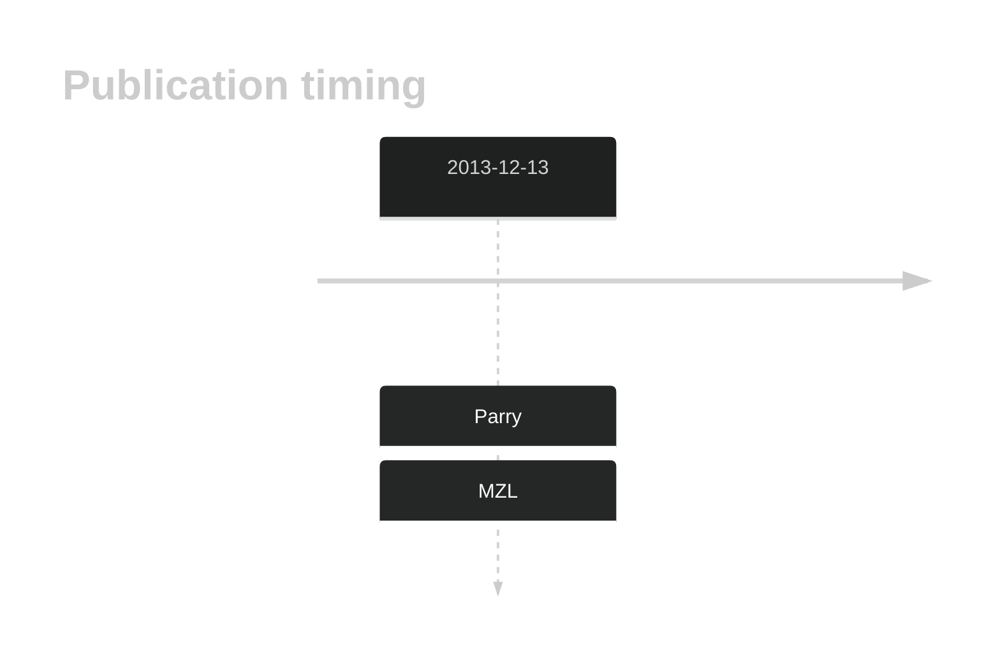

# CBFA2T3

## History

## Relevance tier by entity

|Entity|Tier|Description|
|:------:|:----:|--------------------------------------|
||2|relevance in MZL not firmly established[@parryWholeExomeSequencing2013]|

## Mutation incidence in large patient cohorts (GAMBL reanalysis)

|Entity|source |frequency (%)|
|:------:|:----:|:----:|
|BL|GAMBL Exome |2.299 |
|BL|GAMBL Genome |0.772 |
|DLBCL|GAMBL Exome |1.294 |
|DLBCL|GAMBL Genome |0.564 |
|MCL|GAMBL Genome |0.585 |

## References

