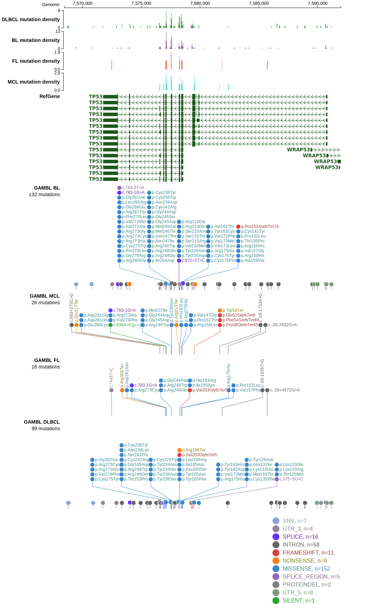

# [CCDC42BPB]

## Mutation tier

|Entity|Tier|Description                           |
|:------:|:----:|--------------------------------------|
|FL    |2   |relevance in FL not firmly established|
## Mutation incidence

|Entity|source       |frequency (%)|
|:------:|:-------------:|:-------------:|
|FL    |GAMBL genomes|NA           |

## Mutation pattern

|

> [!NOTE]
> First described in FL in 2021 by [Hübschmann D](https://pubmed.ncbi.nlm.nih.gov/33953289)

View coding variants in ProteinPaint [hg19](https://www.bcgsc.ca/downloads/morinlab/GAMBL/test/genes/CCDC42BPB_protein.html)  or [hg38](https://www.bcgsc.ca/downloads/morinlab/GAMBL/test/genes/CCDC42BPB_protein_hg38.html)

View all variants in GenomePaint [hg19](https://www.bcgsc.ca/downloads/morinlab/GAMBL/test/genes/CCDC42BPB.html)  or [hg38](https://www.bcgsc.ca/downloads/morinlab/GAMBL/test/genes/CCDC42BPB_hg38.html)

