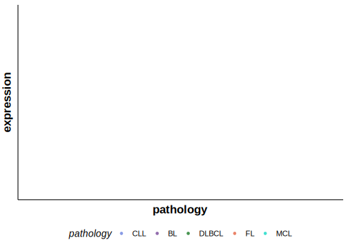

# CCDC42BPB

## Relevance tier by entity

|Entity|Tier|Description                           |
|:------:|:----:|--------------------------------------|
|FL    |2   |relevance in FL not firmly established|

## Mutation incidence in large patient cohorts (GAMBL reanalysis)

|Entity|source       |frequency (%)|
|:------:|:-------------:|:-------------:|
|FL    |GAMBL genomes|NA           |

## Mutation pattern and selective pressure estimates

|

> [!NOTE]
> First described in FL in 2021 by [Hübschmann D](https://pubmed.ncbi.nlm.nih.gov/33953289)

View coding variants in ProteinPaint [hg19](https://morinlab.github.io/LLMPP/GAMBL/CCDC42BPB_protein.html)  or [hg38](https://morinlab.github.io/LLMPP/GAMBL/CCDC42BPB_protein_hg38.html)

View all variants in GenomePaint [hg19](https://morinlab.github.io/LLMPP/GAMBL/CCDC42BPB.html)  or [hg38](https://morinlab.github.io/LLMPP/GAMBL/CCDC42BPB_hg38.html)

## CCDC42BPB Expression

<!-- ORIGIN: hubschmannMutationalMechanismsShaping2021b -->
