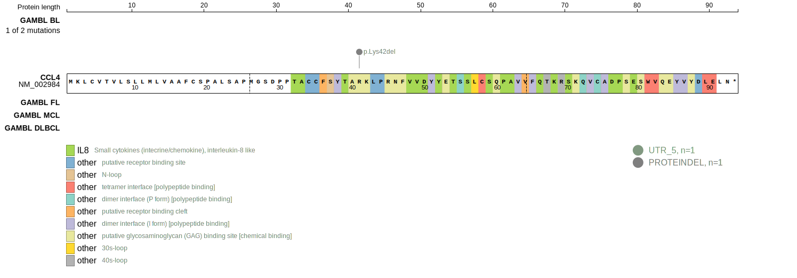
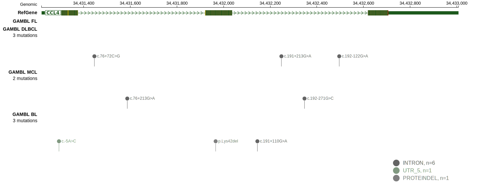

# CCL4

## Relevance tier by entity

|Entity|Tier|Description                              |
|:------:|:----:|-----------------------------------------|
| |2   |relevance in DLBCL not firmly established|

## Mutation incidence in large patient cohorts (GAMBL reanalysis)

|Entity|source        |frequency (%)|
|:------:|:--------------:|:-------------:|
|DLBCL |GAMBL genomes |0.19         |
|DLBCL |Schmitz cohort|1.49         |
|DLBCL |Reddy cohort  |0.60         |
|DLBCL |Chapuy cohort |1.28         |

## Mutation pattern and selective pressure estimates

|Entity|aSHM|Significant selection|dN/dS (missense)|dN/dS (nonsense)|
|:------:|:----:|:---------------------:|:----------------:|:----------------:|
|BL    |No  |No                   |0.000           |0               |
|DLBCL |No  |No                   |3.891           |0               |
|FL    |No  |No                   |0.000           |0               |

> [!NOTE]
> First described in DLBCL in 2018 by [Chapuy B](https://pubmed.ncbi.nlm.nih.gov/29713087)

View coding variants in ProteinPaint [hg19](https://morinlab.github.io/LLMPP/GAMBL/CCL4_protein.html)  or [hg38](https://morinlab.github.io/LLMPP/GAMBL/CCL4_protein_hg38.html)

View all variants in GenomePaint [hg19](https://morinlab.github.io/LLMPP/GAMBL/CCL4.html)  or [hg38](https://morinlab.github.io/LLMPP/GAMBL/CCL4_hg38.html)

## CCL4 Expression

<!-- ORIGIN: chapuyMolecularSubtypesDiffuse2018b -->
<!-- DLBCL: chapuyMolecularSubtypesDiffuse2018b -->
