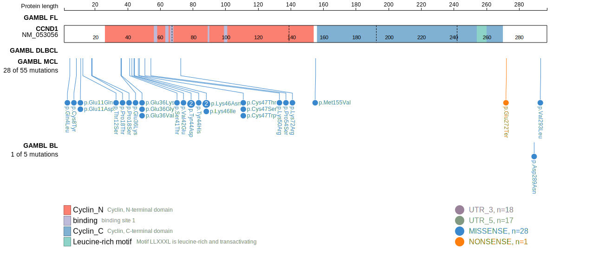
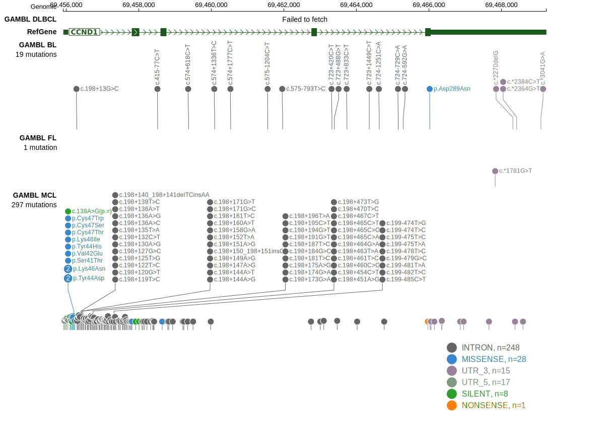

# CCND1

## Relevance tier by entity

|Entity|Tier|Description             |
|:------:|:----:|------------------------|
|   |1   |high-confidence MCL gene|

## Mutation incidence in large patient cohorts (GAMBL reanalysis)

|Entity|source       |frequency (%)|
|:------:|:-------------:|:-------------:|
|MCL   |GAMBL genomes|14.69        |

## Mutation pattern and selective pressure estimates

|Entity|aSHM|Significant selection|dN/dS (missense)|dN/dS (nonsense)|
|:------:|:----:|:---------------------:|:----------------:|:----------------:|
|BL    |No  |No                   |1.909           |0               |
|DLBCL |No  |No                   |0.000           |0               |
|FL    |No  |No                   |0.000           |0               |

> [!NOTE]
> First described in MCL in 2013 by [Beà S](https://pubmed.ncbi.nlm.nih.gov/24145436)

View coding variants in ProteinPaint [hg19](https://morinlab.github.io/LLMPP/GAMBL/CCND1_protein.html)  or [hg38](https://morinlab.github.io/LLMPP/GAMBL/CCND1_protein_hg38.html)

View all variants in GenomePaint [hg19](https://morinlab.github.io/LLMPP/GAMBL/CCND1.html)  or [hg38](https://morinlab.github.io/LLMPP/GAMBL/CCND1_hg38.html)

## CCND1 Expression

<!-- ORIGIN: beaLandscapeSomaticMutations2013 -->
<!-- MCL: beaLandscapeSomaticMutations2013 -->
