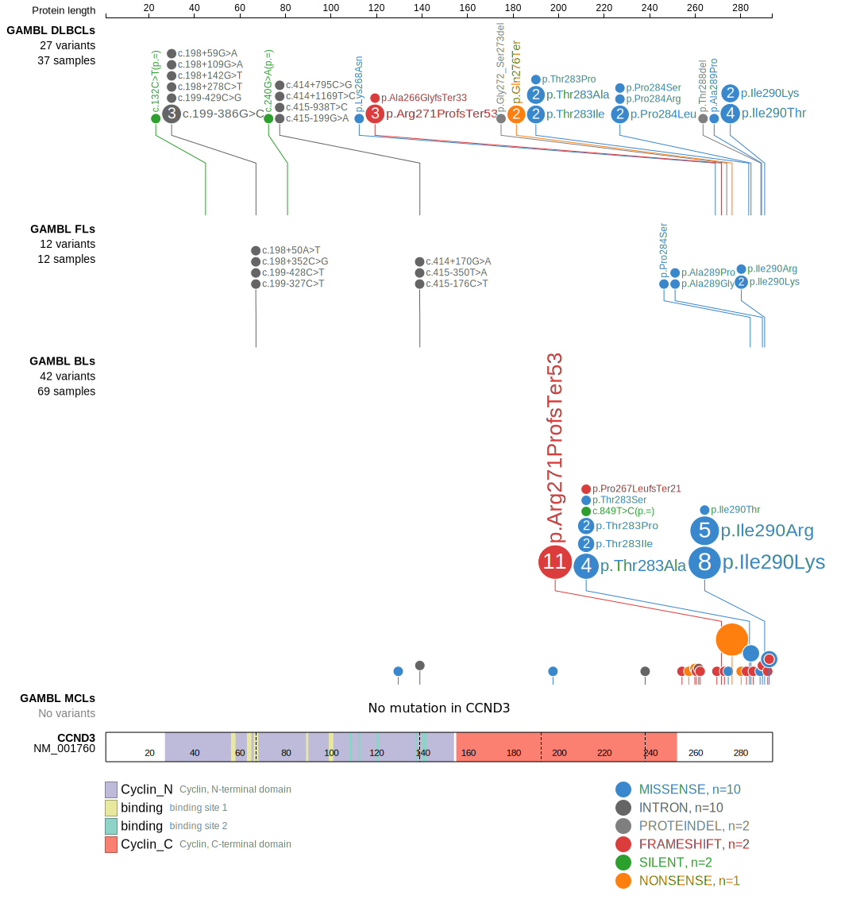

# [CCND3]

## Mutation tier

|Entity|Tier|Description               |
|:------:|:----:|--------------------------|
|BL    |1   |high-confidence BL gene   |
|DLBCL |1   |high-confidence DLBCL gene|
|FL    |1   |high-confidence FL gene   |
## Mutation incidence

|Entity|source               |frequency (%)|
|:------:|:---------------------:|:-------------:|
|BL    |GAMBL genomes+capture|27.48        |
|BL    |Thomas cohort        |28.00        |
|BL    |Panea cohort         |17.80        |
|DLBCL |GAMBL genomes        | 7.46        |
|DLBCL |Schmitz cohort       | 9.80        |
|DLBCL |Reddy cohort         | 3.80        |
|DLBCL |Chapuy cohort        | 4.70        |
|FL    |GAMBL genomes        | 3.23        |

## Mutation pattern

|Entity|aSHM|Significant selection|dN/dS (missense)|dN/dS (nonsense)|
|:------:|:----:|:---------------------:|:----------------:|:----------------:|
|BL    |No  |Yes                  |97.799          |360.774         |
|DLBCL |No  |Yes                  |19.557          | 60.833         |
|FL    |No  |No                   |24.611          |  0.000         |

> [!NOTE]
> First described in BL in 2012 by [Schmitz R](https://pubmed.ncbi.nlm.nih.gov/22885699). First described in DLBCL in 2011 by [Morin RD](https://pubmed.ncbi.nlm.nih.gov/21796119). First described in FL in 2011 by [Morin RD](https://pubmed.ncbi.nlm.nih.gov/21796119)

View coding variants in ProteinPaint [hg19](https://www.bcgsc.ca/downloads/morinlab/GAMBL/test/genes/CCND3_protein.html)  or [hg38](https://www.bcgsc.ca/downloads/morinlab/GAMBL/test/genes/CCND3_protein_hg38.html)

View all variants in GenomePaint [hg19](https://www.bcgsc.ca/downloads/morinlab/GAMBL/test/genes/CCND3.html)  or [hg38](https://www.bcgsc.ca/downloads/morinlab/GAMBL/test/genes/CCND3_hg38.html)

