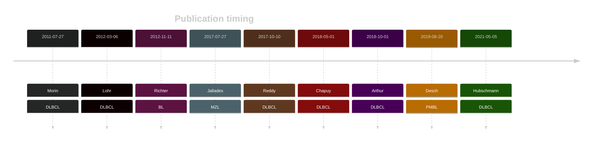

# CCND3

## Overview
CCND3 (Cyclin D3) is a gene that encodes a protein involved in the regulation of the cell cycle. Mutations in CCND3 are implicated in various types of B-cell lymphomas, including Burkitt lymphoma and diffuse large B-cell lymphoma (DLBCL).[@richterRecurrentMutationID32012a; @morinFrequentMutationHistonemodifying2011]

## Experimental Evidence
Somatic mutations in CCND3 often stabilize the Cyclin D3 protein by altering the phosphorylation motif, which is crucial for proteasomal degradation. These mutations are associated with an increase in Cyclin D3 protein stability and oncogenic potential.[@schmitzBurkittLymphomaPathogenesis2012]

## Relevance tier by entity

|Entity|Tier|Description               |
|:------:|:----:|--------------------------|
||1|high-confidence MZL gene[@jalladesExomeSequencingIdentifies2017]|
||2|relevance in PMBL/cHL/GZL not firmly established[@deschGenotypingCirculatingTumor2020]|
|    |1-EE   |high-confidence BL gene   [@richterRecurrentMutationID32012]|
| |1-EE   |high-confidence DLBCL gene[@morinFrequentMutationHistonemodifying2011]|
|    |1-EE   |high-confidence FL gene   [@morinFrequentMutationHistonemodifying2011]|

## Mutation incidence in large patient cohorts (GAMBL reanalysis)

|Entity|source               |frequency (%)|
|:------:|:---------------------:|:-------------:|
|BL    |GAMBL genomes+capture|27.48        |
|BL    |Thomas cohort        |28.00        |
|BL    |Panea cohort         |17.80        |
|DLBCL |GAMBL genomes        | 7.46        |
|DLBCL |Schmitz cohort       | 9.79        |
|DLBCL |Reddy cohort         | 3.80        |
|DLBCL |Chapuy cohort        | 4.70        |
|FL    |GAMBL genomes        | 3.23        |

## Mutation pattern and selective pressure estimates

|Entity|aSHM|Significant selection|dN/dS (missense)|dN/dS (nonsense)|
|:------:|:----:|:---------------------:|:----------------:|:----------------:|
|BL    |No  |Yes                  |97.799          |360.774         |
|DLBCL |No  |Yes                  |19.557          | 60.833         |
|FL    |No  |No                   |24.611          |  0.000         |

## CCND3 Hotspots

### Exon 5 Hotspot
T283 (Threonine 283): One of the most frequently mutated sites in CCND3. Mutations at this site can result in enhanced cyclin D3 stability and increased cell cycle progression.

I290 (Isoleucine 290): Another common mutation in exon 5. Mutations here are associated with similar functional impacts as E283, promoting uncontrolled cell proliferation.

### Exon 1 and Exon 2
While exon 5 is the primary hotspot, mutations in exon 1 and exon 2 have also been observed, though less frequently. These mutations can affect the regulatory regions of the gene, potentially increasing levels of CCND3 by promoting stability of the protein.

### Functional Impact of CCND3 Mutations
**Cell Cycle Dysregulation:**
CCND3, along with other cyclins, regulates the transition from the G1 phase to the S phase of the cell cycle. Mutations in CCND3 can lead to its overexpression or increased stability, resulting in accelerated cell cycle progression and uncontrolled cell division.

**Increased Protein Stability:**
Mutations at E283 and D290 often result in the increased stability of the cyclin D3 protein, preventing its degradation. This leads to sustained activation of CDK4/6 (cyclin-dependent kinases), further driving cell cycle progression.

**Oncogenic Potential:**
The dysregulation of CCND3 due to these mutations contributes to the oncogenic potential of B-cell lymphomas. By promoting continuous cell proliferation, these mutations help lymphoma cells evade normal growth control mechanisms.

| Chromosome |Coordinate (hg19) | ref>alt | HGVSp | 
 | :---:| :---: | :--: | :---: |
| chr6 | 41903736 | C>G | S274T |
| chr6 | 41903731 | G>A | Q276* |
| chr6 | 41903719 | G>A | Q280* |
| chr6 | 41903710 | T>G | T283P |
| chr6 | 41903710 | T>C | T283A |
| chr6 | 41903710 | T>A | T283S |
| chr6 | 41903709 | G>A | T283I |
| chr6 | 41903707 | G>A | P284S |
| chr6 | 41903706 | G>C | P284R |
| chr6 | 41903706 | G>A | P284L |
| chr6 | 41903694 | G>C | T288R |
| chr6 | 41903692 | C>G | A289P |
| chr6 | 41903691 | G>C | A289G |
| chr6 | 41903688 | A>T | I290K |
| chr6 | 41903688 | A>G | I290T |
| chr6 | 41903688 | A>C | I290R |
| chr6 | 41903682 | A>T | L292Q |
| chr6 | 41903682 | A>C | L292R |

View coding variants in ProteinPaint [hg19](https://morinlab.github.io/LLMPP/GAMBL/CCND3_protein.html)  or [hg38](https://morinlab.github.io/LLMPP/GAMBL/CCND3_protein_hg38.html)

View all variants in GenomePaint [hg19](https://morinlab.github.io/LLMPP/GAMBL/CCND3.html)  or [hg38](https://morinlab.github.io/LLMPP/GAMBL/CCND3_hg38.html)

## CCND3 Expression

<!-- ORIGIN: morinFrequentMutationHistonemodifying2011 -->
<!-- FL: morinFrequentMutationHistonemodifying2011 -->
<!-- BL: richterRecurrentMutationID32012a -->
<!-- BL: richterRecurrentMutationID32012a -->
<!-- DLBCL: morinFrequentMutationHistonemodifying2011 -->
<!-- MZL: jalladesExomeSequencingIdentifies2017 -->
<!-- PMBL: deschGenotypingCirculatingTumor2020 -->

## References

