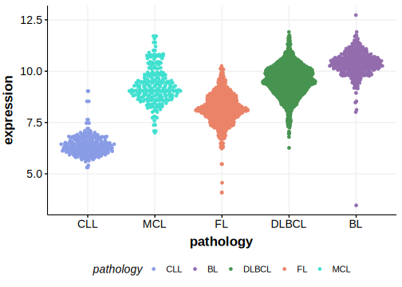

[[_TOC_]]

## Relevance tier by entity

[[include:table1_CCNF.md]]

## Mutation incidence in large patient cohorts (GAMBL reanalysis)

|Entity|source               |frequency (%)|
|:------:|:---------------------:|:-------------:|
|BL    |GAMBL genomes+capture|1.62         |
|BL    |Thomas cohort        |  NA         |
|BL    |Panea cohort         |  NA         |

## Mutation pattern and selective pressure estimates

[[include:tables/dnds_CCNF.md]]

[[include:browser_CCNF.md]]

## Expression

<!-- ORIGIN: abateDistinctViralMutational2015a -->
<!-- BL: abateDistinctViralMutational2015a -->

[[include:tables/mermaid_CCNF.md]]

## References
