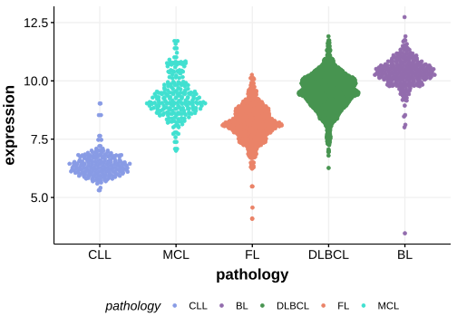

[[_TOC_]]

## Relevance tier by entity

[[include:tables/table1_CCNF.md]]

## Mutation incidence in large patient cohorts (GAMBL reanalysis)

### DLBCL
[[include:tables/DLBCL_CCNF.md]]

### FL
[[include:tables/FL_CCNF.md]]

### BL
[[include:tables/BL_CCNF.md]]

## Mutation pattern and selective pressure estimates

[[include:tables/dnds_CCNF.md]]

[[include:tables/browser_CCNF.md]]

## Expression

<!-- ORIGIN: abateDistinctViralMutational2015a -->
<!-- BL: abateDistinctViralMutational2015a -->

[[include:tables/mermaid_CCNF.md]]

## References
