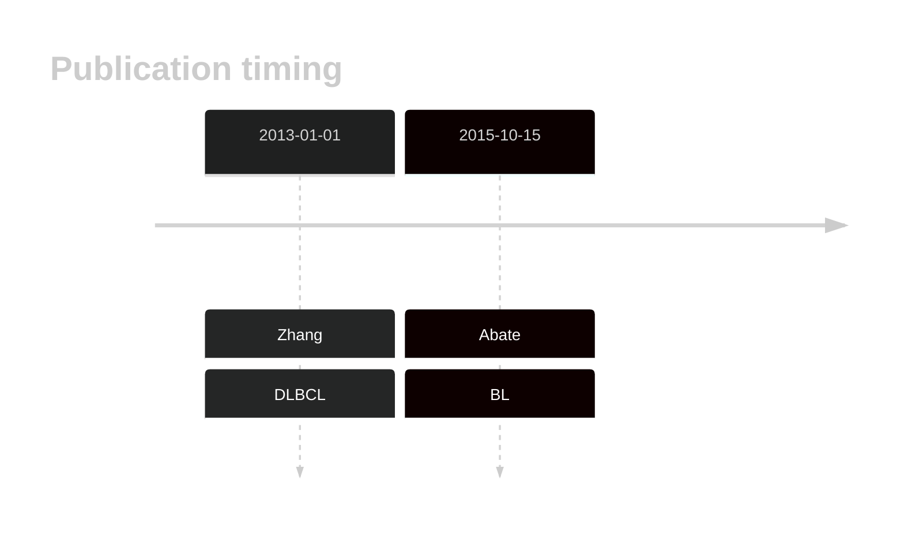

# CCNF

## History

## Relevance tier by entity

|Entity|Tier|Description                           |
|:------:|:----:|--------------------------------------|
|    |2   |relevance in BL not firmly established[@abateDistinctViralMutational2015]|

## Mutation incidence in large patient cohorts (GAMBL reanalysis)

|Entity|source               |frequency (%)|
|:------:|:---------------------:|:-------------:|
|BL    |GAMBL genomes+capture|1.62         |
|BL    |Thomas cohort        |  NA         |
|BL    |Panea cohort         |  NA         |

## Mutation pattern and selective pressure estimates

|Entity|aSHM|Significant selection|dN/dS (missense)|dN/dS (nonsense)|
|:------:|:----:|:---------------------:|:----------------:|:----------------:|
|BL    |No  |No                   |2.194           |0               |
|DLBCL |No  |No                   |1.303           |0               |
|FL    |No  |No                   |0.000           |0               |

View coding variants in ProteinPaint [hg19](https://morinlab.github.io/LLMPP/GAMBL/CCNF_protein.html)  or [hg38](https://morinlab.github.io/LLMPP/GAMBL/CCNF_protein_hg38.html)

View all variants in GenomePaint [hg19](https://morinlab.github.io/LLMPP/GAMBL/CCNF.html)  or [hg38](https://morinlab.github.io/LLMPP/GAMBL/CCNF_hg38.html)

## CCNF Expression

<!-- ORIGIN: abateDistinctViralMutational2015a -->
<!-- BL: abateDistinctViralMutational2015a -->

## References
