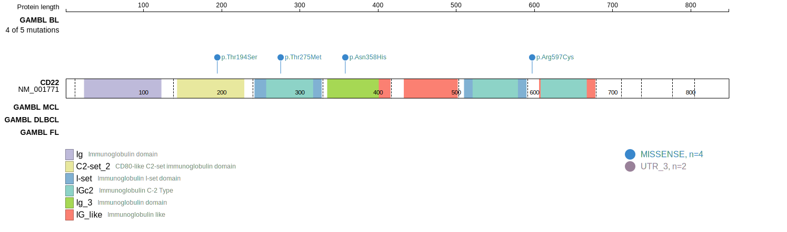
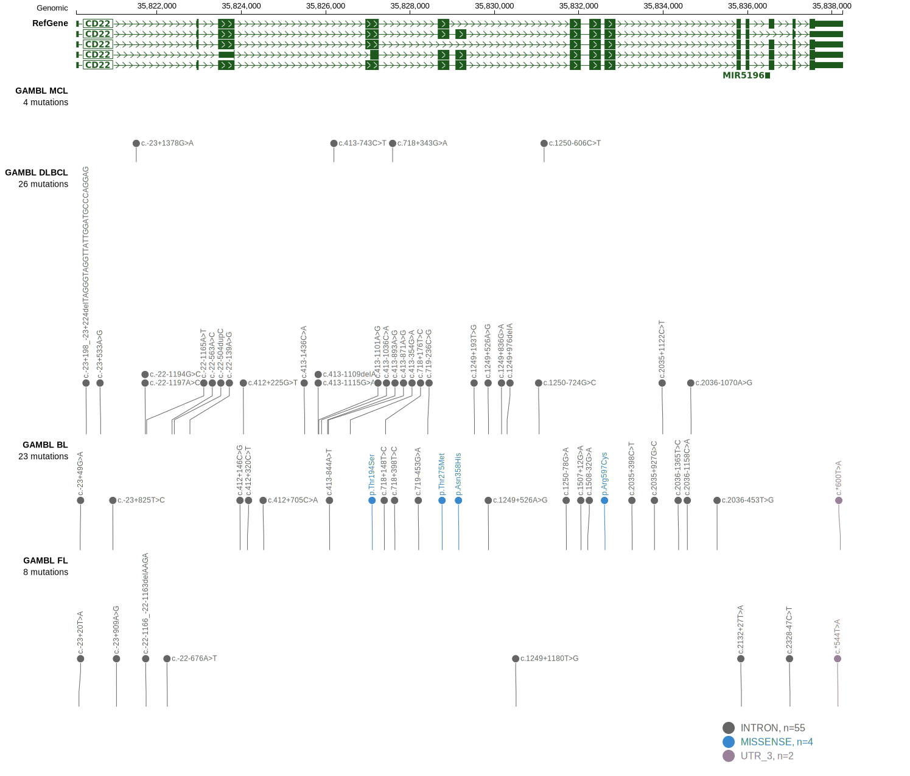
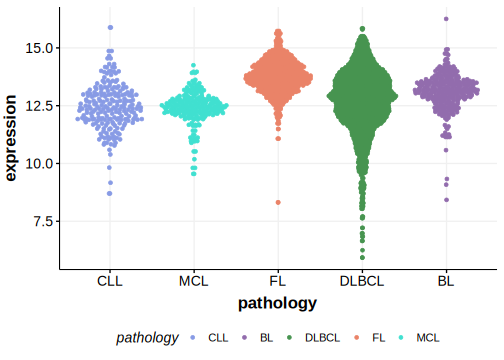

[[_TOC_]]

Mutations in this gene were first described in DLBCL in 2017 by Reddy et al.1 Subsequent exome and genome-wide studies of DLBCL did not reproduce this observation. 

## Relevance tier by entity

|Entity|Tier|Description                              |
|:------:|:----:|-----------------------------------------|
| |2   |relevance in DLBCL not firmly established[@reddyGeneticFunctionalDrivers2017]|

## Mutation incidence in large patient cohorts (GAMBL reanalysis)

|Entity|source        |frequency (%)|
|:------:|:--------------:|:-------------:|
|DLBCL |GAMBL genomes |1.15         |
|DLBCL |Schmitz cohort|1.70         |
|DLBCL |Reddy cohort  |2.80         |
|DLBCL |Chapuy cohort |2.99         |

## Mutation pattern and selective pressure estimates

|Entity|aSHM|Significant selection|dN/dS (missense)|dN/dS (nonsense)|
|:------:|:----:|:---------------------:|:----------------:|:----------------:|
|BL    |No  |No                   |4.287           |0               |
|DLBCL |No  |No                   |1.951           |0               |
|FL    |No  |No                   |0.000           |0               |

View coding variants in ProteinPaint [hg19](https://morinlab.github.io/LLMPP/GAMBL/CD22_protein.html)  or [hg38](https://morinlab.github.io/LLMPP/GAMBL/CD22_protein_hg38.html)

View all variants in GenomePaint [hg19](https://morinlab.github.io/LLMPP/GAMBL/CD22.html)  or [hg38](https://morinlab.github.io/LLMPP/GAMBL/CD22_hg38.html)

## CD22 Expression

[[include:mermaid_CD22.md]]

## References

<!-- ORIGIN: reddyGeneticFunctionalDrivers2017 -->
<!-- DLBCL: reddyGeneticFunctionalDrivers2017 -->
