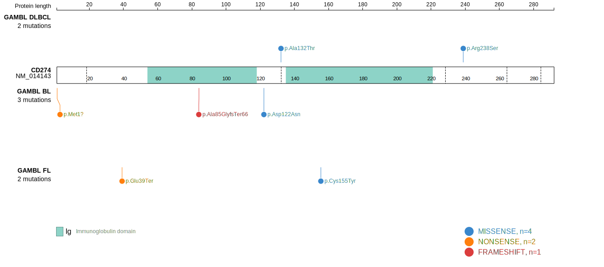
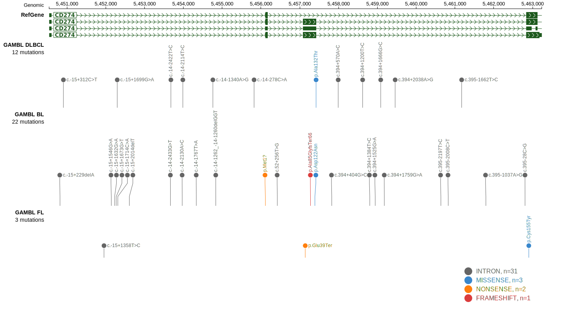

# CD274
## Overview
the CD274 gene encodes the programmed death-ligand 1 (PD-L1). Mutations in B-cell lymphomas, such as DLBCL, are relatively rare.1 Although rare, mutations have the potential to impact PD-L1 expression and could be relevant in the context of immune checkpoint inhibitors. 

## Relevance tier by entity

|Entity|Tier|Description               |
|:------:|:----:|--------------------------|
|DLBCL |1   |high-confidence DLBCL gene|

## Mutation incidence in large patient cohorts (GAMBL reanalysis)

|Entity|source        |frequency (%)|
|:------:|:--------------:|:-------------:|
|DLBCL |GAMBL genomes |0.96         |
|DLBCL |Schmitz cohort|2.34         |
|DLBCL |Reddy cohort  |1.30         |
|DLBCL |Chapuy cohort |2.56         |

## Mutation pattern and selective pressure estimates

|Entity|aSHM|Significant selection|dN/dS (missense)|dN/dS (nonsense)|
|:------:|:----:|:---------------------:|:----------------:|:----------------:|
|BL    |No  |No                   |5.538           | 0.000          |
|DLBCL |No  |No                   |2.633           |49.045          |
|FL    |No  |No                   |4.631           |42.709          |

> [!NOTE]
> First described in DLBCL in 2011 by [Morin RD](https://pubmed.ncbi.nlm.nih.gov/21796119)

View coding variants in ProteinPaint [hg19](https://morinlab.github.io/LLMPP/GAMBL/CD274_protein.html)  or [hg38](https://morinlab.github.io/LLMPP/GAMBL/CD274_protein_hg38.html)

View all variants in GenomePaint [hg19](https://morinlab.github.io/LLMPP/GAMBL/CD274.html)  or [hg38](https://morinlab.github.io/LLMPP/GAMBL/CD274_hg38.html)

## References

1. *Huang RSP, Decker B, Murugesan K, Hiemenz M, Mata DA, Li G, Creeden J, Ramkissoon SH, Ross JS. Pan-cancer analysis of CD274 (PD-L1) mutations in 314,631 patient samples and subset correlation with PD-L1 protein expression. J Immunother Cancer. 2021 Jun;9(6):e002558. doi: 10.1136/jitc-2021-002558. PMID: 34130989; PMCID: PMC8207995.*
