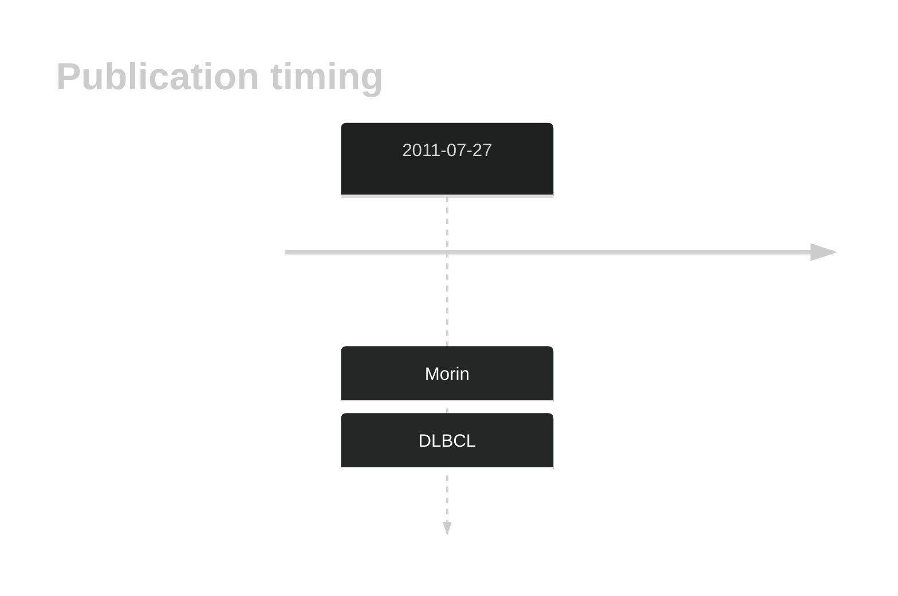

# CD274

## Overview
the CD274 gene encodes the programmed death-ligand 1 (PD-L1). Mutations in B-cell lymphomas, such as DLBCL, are relatively rare.1 Although rare, mutations have the potential to impact PD-L1 expression and could be relevant in the context of immune checkpoint inhibitors. 
## History

## Relevance tier by entity

|Entity|Tier|Description               |
|:------:|:----:|--------------------------|
| |1   |high-confidence DLBCL gene|

## Mutation incidence in large patient cohorts (GAMBL reanalysis)

|Entity|source        |frequency (%)|
|:------:|:--------------:|:-------------:|
|DLBCL |GAMBL genomes |0.96         |
|DLBCL |Schmitz cohort|2.34         |
|DLBCL |Reddy cohort  |1.30         |
|DLBCL |Chapuy cohort |2.56         |

## Mutation pattern and selective pressure estimates

|Entity|aSHM|Significant selection|dN/dS (missense)|dN/dS (nonsense)|
|:------:|:----:|:---------------------:|:----------------:|:----------------:|
|BL    |No  |No                   |5.538           | 0.000          |
|DLBCL |No  |No                   |2.633           |49.045          |
|FL    |No  |No                   |4.631           |42.709          |

View coding variants in ProteinPaint [hg19](https://morinlab.github.io/LLMPP/GAMBL/CD274_protein.html)  or [hg38](https://morinlab.github.io/LLMPP/GAMBL/CD274_protein_hg38.html)

View all variants in GenomePaint [hg19](https://morinlab.github.io/LLMPP/GAMBL/CD274.html)  or [hg38](https://morinlab.github.io/LLMPP/GAMBL/CD274_hg38.html)

## CD274 Expression

## References

1. *Huang RSP, Decker B, Murugesan K, Hiemenz M, Mata DA, Li G, Creeden J, Ramkissoon SH, Ross JS. Pan-cancer analysis of CD274 (PD-L1) mutations in 314,631 patient samples and subset correlation with PD-L1 protein expression. J Immunother Cancer. 2021 Jun;9(6):e002558. doi: 10.1136/jitc-2021-002558. PMID: 34130989; PMCID: PMC8207995.*
2. *Morin RD, Mendez-Lago M, Mungall AJ, Goya R, Mungall KL, Corbett RD, Johnson NA, Severson TM, Chiu R, Field M, Jackman S, Krzywinski M, Scott DW, Trinh DL, Tamura-Wells J, Li S, Firme MR, Rogic S, Griffith M, Chan S, Yakovenko O, Meyer IM, Zhao EY, Smailus D, Moksa M, Chittaranjan S, Rimsza L, Brooks-Wilson A, Spinelli JJ, Ben-Neriah S, Meissner B, Woolcock B, Boyle M, McDonald H, Tam A, Zhao Y, Delaney A, Zeng T, Tse K, Butterfield Y, Birol I, Holt R, Schein J, Horsman DE, Moore R, Jones SJ, Connors JM, Hirst M, Gascoyne RD, Marra MA. Frequent mutation of histone-modifying genes in non-Hodgkin lymphoma. Nature. 2011 Jul 27;476(7360):298-303. doi: 10.1038/nature10351. PMID: 21796119; PMCID: PMC3210554.*
<!-- ORIGIN: morinFrequentMutationHistonemodifying2011 -->
<!-- DLBCL: morinFrequentMutationHistonemodifying2011 -->
