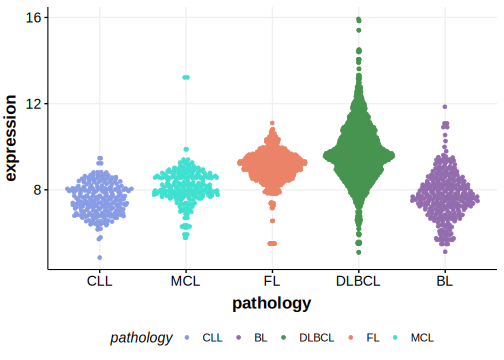

[[_TOC_]]

## Overview
the CD274 gene encodes the programmed death-ligand 1 (PD-L1). Mutations in B-cell lymphomas, such as DLBCL, are relatively rare.
Although rare, mutations have the potential to impact PD-L1 expression and could be relevant in the context of immune checkpoint inhibitors. 

## Relevance tier by entity

[[include:table1_CD274.md]]

## Mutation incidence in large patient cohorts (GAMBL reanalysis)

|Entity|source        |frequency (%)|
|:------:|:--------------:|:-------------:|
|DLBCL |GAMBL genomes |0.96         |
|DLBCL |Schmitz cohort|2.34         |
|DLBCL |Reddy cohort  |1.30         |
|DLBCL |Chapuy cohort |2.56         |

## Mutation pattern and selective pressure estimates

[[include:tables/dnds_CD274.md]]

[[include:browser_CD274.md]]

## Expression

[[include:mermaid_CD274.md]]

## References

<!-- ORIGIN: morinFrequentMutationHistonemodifying2011 -->
<!-- DLBCL: morinFrequentMutationHistonemodifying2011 -->
