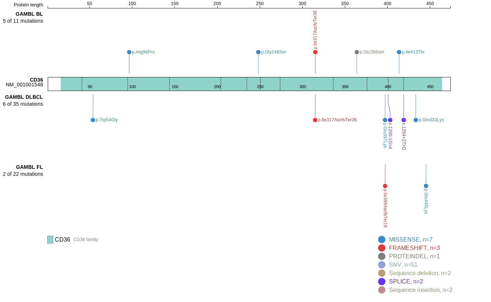
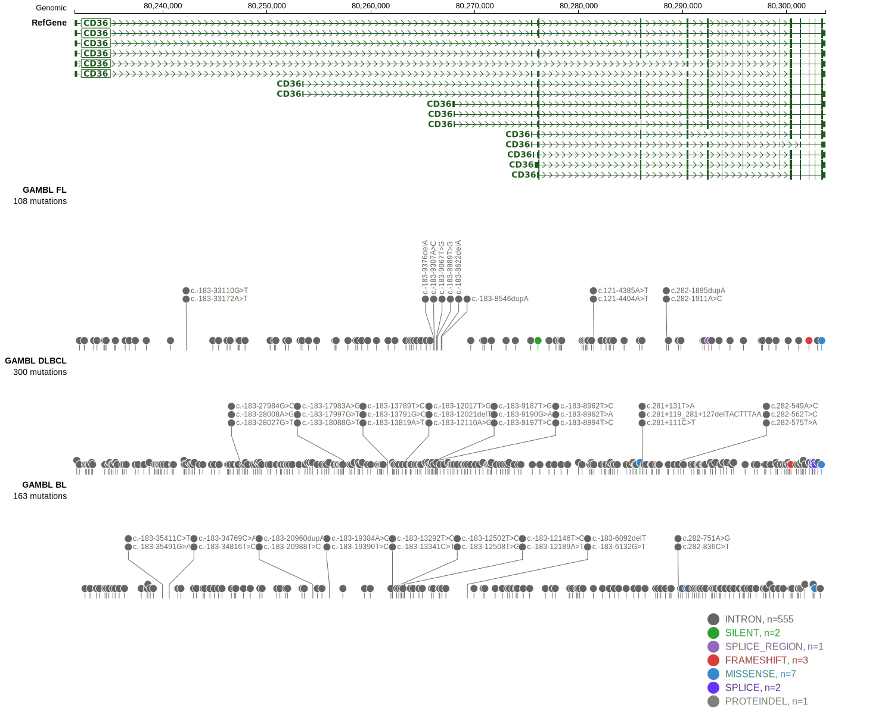
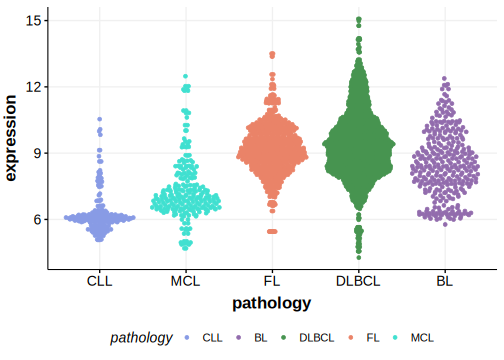

# CD36

CD36 is a transmembrane glycoprotein involved in fatty acid metabolism, glucose intolerance, and immune responses. It is expressed on various cell types, including platelets, monocytes, and some lymphocytes. One study showed higher rates of CD36 mutations in FL relative to DLBCLs.1

## Relevance tier by entity

|Entity|Tier|Description               |
|:------:|:----:|--------------------------|
|DLBCL |1   |high-confidence DLBCL gene|

## Mutation incidence in large patient cohorts (GAMBL reanalysis)

|Entity|source        |frequency (%)|
|:------:|:--------------:|:-------------:|
|DLBCL |GAMBL genomes |2.29         |
|DLBCL |Schmitz cohort|4.89         |
|DLBCL |Reddy cohort  |2.80         |
|DLBCL |Chapuy cohort |2.99         |

## Mutation pattern and selective pressure estimates

|Entity|aSHM|Significant selection|dN/dS (missense)|dN/dS (nonsense)|
|:------:|:----:|:---------------------:|:----------------:|:----------------:|
|BL    |No  |No                   |4.616           |0.000           |
|DLBCL |No  |No                   |0.822           |7.247           |
|FL    |No  |No                   |1.559           |0.000           |

> [!NOTE]
> First described in DLBCL in 2011 by [Pasqualucci L](https://pubmed.ncbi.nlm.nih.gov/21804550)

View coding variants in ProteinPaint [hg19](https://morinlab.github.io/LLMPP/GAMBL/CD36_protein.html)  or [hg38](https://morinlab.github.io/LLMPP/GAMBL/CD36_protein_hg38.html)

View all variants in GenomePaint [hg19](https://morinlab.github.io/LLMPP/GAMBL/CD36.html)  or [hg38](https://morinlab.github.io/LLMPP/GAMBL/CD36_hg38.html)

## References

1. *Carreras J, Ikoma H, Kikuti YY, Miyaoka M, Hiraiwa S, Tomita S, Kondo Y, Ito A, Nagase S, Miura H, Kawada H, Roncador G, Campo E, Hamoudi R, Nakamura N. Mutational, immune microenvironment, and clinicopathological profiles of diffuse large B-cell lymphoma and follicular lymphoma with BCL6 rearrangement. Virchows Arch. 2024 Apr;484(4):657-676. doi: 10.1007/s00428-024-03774-z. Epub 2024 Mar 11. PMID: 38462571.*
## CD36 Expression

