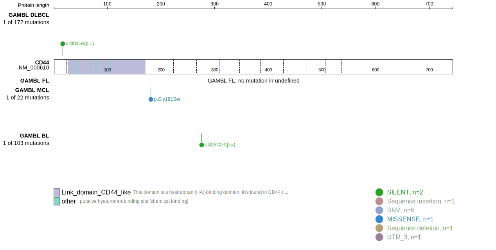
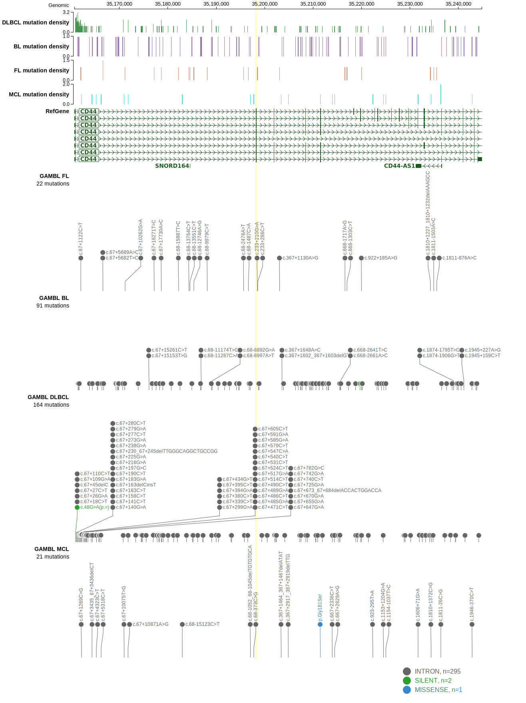

# CD44

## Relevance tier by entity

|Entity|Tier|Description                              |
|:------:|:----:|-----------------------------------------|
|DLBCL |2-a | aSHM target; Although recurrent, the relevance of mutations in DLBCL is tenuous |

## Mutation incidence in large patient cohorts (GAMBL reanalysis)

|Entity|source        |frequency (%)|
|:------:|:--------------:|:-------------:|
|DLBCL |GAMBL genomes |0.19         |
|DLBCL |Schmitz cohort|1.49         |
|DLBCL |Reddy cohort  |1.40         |
|DLBCL |Chapuy cohort |2.14         |

## Mutation pattern and selective pressure estimates

|Entity|aSHM|Significant selection|dN/dS (missense)|dN/dS (nonsense)|
|:------:|:----:|:---------------------:|:----------------:|:----------------:|
|BL    |Yes |No                   |0.00            |0               |
|DLBCL |Yes |No                   |2.09            |0               |
|FL    |Yes |No                   |0.00            |0               |

## aSHM regions

|chr_name|hg19_start|hg19_end|region                                                                                    |regulatory_comment|
|:--------:|:----------:|:--------:|:------------------------------------------------------------------------------------------:|:------------------:|
|chr11   |35156769  |35164248|[TSS](https://genome.ucsc.edu/s/rdmorin/GAMBL%20hg19?position=chr11%3A35156769%2D35164248)|active_promoter   |

> [!NOTE]
> First described in DLBCL in 2018 by [Arthur SE](https://pubmed.ncbi.nlm.nih.gov/30275490)

View coding variants in ProteinPaint [hg19](https://www.bcgsc.ca/downloads/morinlab/GAMBL/test/genes/CD44_protein.html)  or [hg38](https://www.bcgsc.ca/downloads/morinlab/GAMBL/test/genes/CD44_protein_hg38.html)

View all variants in GenomePaint [hg19](https://www.bcgsc.ca/downloads/morinlab/GAMBL/test/genes/CD44.html)  or [hg38](https://www.bcgsc.ca/downloads/morinlab/GAMBL/test/genes/CD44_hg38.html)

