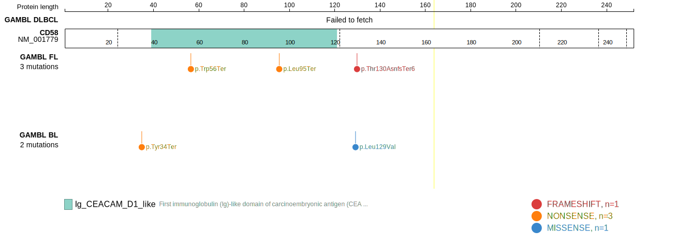
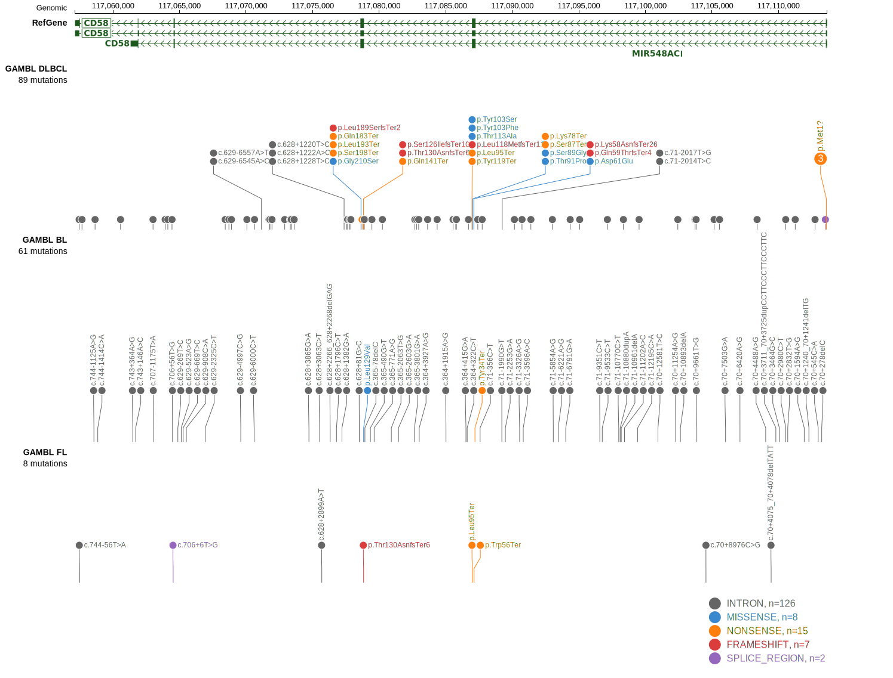

# [CD58]

## Mutation tier

|Entity|Tier|Description                           |
|:------:|:----:|--------------------------------------|
|BL    |2   |relevance in BL not firmly established|
|DLBCL |1   |high-confidence DLBCL gene            |
## Mutation incidence

|Entity|source               |frequency (%)|
|:------:|:---------------------:|:-------------:|
|BL    |GAMBL genomes+capture| 0.92        |
|BL    |Thomas cohort        | 0.80        |
|BL    |Panea cohort         | 2.00        |
|DLBCL |GAMBL genomes        | 7.84        |
|DLBCL |Schmitz cohort       |10.00        |
|DLBCL |Reddy cohort         | 2.80        |
|DLBCL |Chapuy cohort        | 6.80        |

## Mutation pattern

|Entity|aSHM|Significant selection|dN/dS (missense)|dN/dS (nonsense)|
|:------:|:----:|:---------------------:|:----------------:|:----------------:|
|BL    |No  |No                   |3.10            | 32.536         |
|DLBCL |No  |Yes                  |8.62            |292.453         |
|FL    |No  |Yes                  |0.00            |107.458         |

View coding variants in ProteinPaint [hg19](https://www.bcgsc.ca/downloads/morinlab/GAMBL/test/genes/CD58_protein.html)  or [hg38](https://www.bcgsc.ca/downloads/morinlab/GAMBL/test/genes/CD58_protein_hg38.html)

View all variants in GenomePaint [hg19](https://www.bcgsc.ca/downloads/morinlab/GAMBL/test/genes/CD58.html)  or [hg38](https://www.bcgsc.ca/downloads/morinlab/GAMBL/test/genes/CD58_hg38.html)

