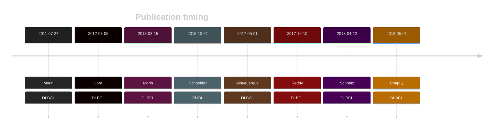

# CD58

## Overview

CD58, also known as lymphocyte function-associated antigen 3 (LFA-3), is crucial for immune recognition, facilitating interactions between tumor cells and cytotoxic T cells and natural killer (NK) cells. 

## Experimental Evidence

In DLBCL, mutations prevent the expression of CD58 on the cell surface, impairing the ability of T and NK cells to recognize and attack the tumor cells. 
This is often accompanied by mutations in the β2-Microglobulin gene, which further aids in immune evasion.[@challa-malladiCombinedGeneticInactivation2011]

## History

## Relevance tier by entity

|Entity|Tier|Description                           |
|:------:|:----:|--------------------------------------|
||1|high-confidence PMBL/cHL/GZL gene[@schneiderAlterationsCD58Gene2015]|
| |1-EE   |high-confidence DLBCL gene            [@morinFrequentMutationHistonemodifying2011]|

## Mutation incidence in large patient cohorts (GAMBL reanalysis)

[[include:DLBCL_CD58.md]]

## Mutation pattern and selective pressure estimates

|Entity|aSHM|Significant selection|dN/dS (missense)|dN/dS (nonsense)|
|:------:|:----:|:---------------------:|:----------------:|:----------------:|
|BL    |No  |No                   |3.10            | 32.536         |
|DLBCL |No  |Yes                  |8.62            |292.453         |
|FL    |No  |Yes                  |0.00            |107.458         |

View coding variants in ProteinPaint [hg19](https://morinlab.github.io/LLMPP/GAMBL/CD58_protein.html)  or [hg38](https://morinlab.github.io/LLMPP/GAMBL/CD58_protein_hg38.html)

View all variants in GenomePaint [hg19](https://morinlab.github.io/LLMPP/GAMBL/CD58.html)  or [hg38](https://morinlab.github.io/LLMPP/GAMBL/CD58_hg38.html)

## CD58 Expression

## References

<!-- ORIGIN: schneiderAlterationsCD58Gene2015a -->
<!-- DLBCL: morinFrequentMutationHistonemodifying2011 -->
<!-- PMBL: schneiderAlterationsCD58Gene2015a -->
