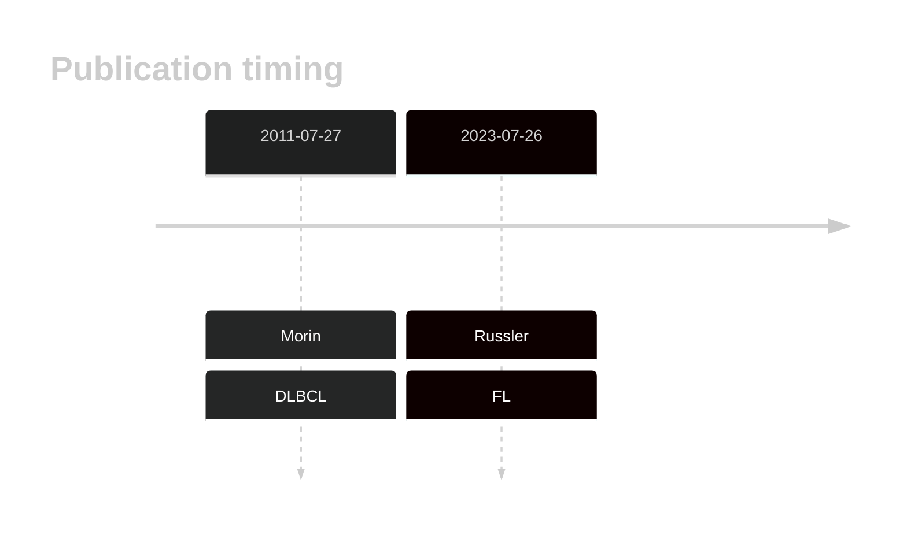
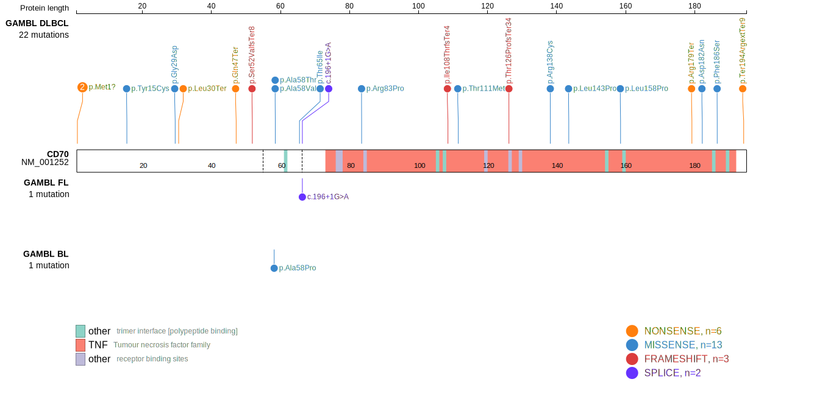
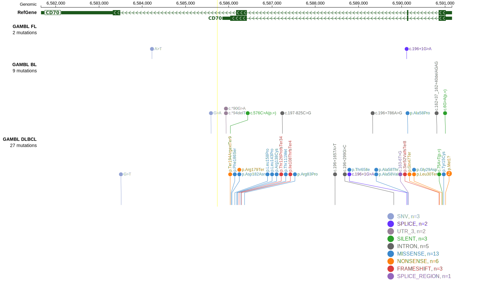
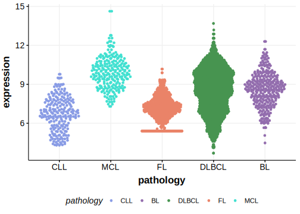

# CD70

## Overview
CD70 is a costimulatory molecule expressed on some activated lymphocytes and has a role in T-cell-mediated immune responses.1 CD70 aberrations are relatively common in DLBCL and appear more frequent in certain DLBCL patient populations. For instance, in a Chinese DLBCL cohort, 24% of cases exhibited CD70 genetic changes, compared to 10.8% in a Swedish cohort.1 CD70 mutations are associated with the BN2 genetic subtype of DLBCL.2 The mutation pattern in CD70 is consistent with the preferential accumulation of *inactivating mutations*. Loss of CD70 protein expression has been described.1 Genetic perturbation limits the development of an effective CD8+ T-cell immune response in Bcl6-driven DLBCL. In mouse models, CD70 loss promoted lymphomagenesis, consistent with its role as a tumor suppressor gene in B-cell lymphomas.1,3
## History

## Relevance tier by entity

|Entity|Tier|Description                           |
|:------:|:----:|--------------------------------------|
| |1   |high-confidence DLBCL gene            |
|    |2   |relevance in FL not firmly established|

## Mutation incidence in large patient cohorts (GAMBL reanalysis)

|Entity|source               |frequency (%)|
|:------:|:---------------------:|:-------------:|
|DLBCL |GAMBL genomes        |5.54         |
|DLBCL |Schmitz cohort       |9.36         |
|DLBCL |Reddy cohort         |6.91         |
|DLBCL |Chapuy cohort        |7.69         |
|FL    |GAMBL genomes        |1.15         |
|BL    |GAMBL genomes+capture|0.92         |
|BL    |Thomas cohort        |0.40         |
|BL    |Panea cohort         |3.00         |

## Mutation pattern and selective pressure estimates

|Entity|aSHM|Significant selection|dN/dS (missense)|dN/dS (nonsense)|
|:------:|:----:|:---------------------:|:----------------:|:----------------:|
|BL    |No  |No                   | 2.199          |  0.000         |
|DLBCL |No  |Yes                  |28.493          |249.836         |
|FL    |No  |No                   | 0.000          |106.251         |

 ## CD70 Hotspots

| Chromosome |Coordinate (hg19) | ref>alt | HGVSp | 
 | :---:| :---: | :--: | :---: |
| chr19 | 6590145 | C>T | W55* |
| chr19 | 6590138 | C>T | A58T |
| chr19 | 6590138 | C>G | A58P |
| chr19 | 6590137 | G>A | A58V |
| chr19 | 6590116 | G>A | T65I |

View coding variants in ProteinPaint [hg19](https://morinlab.github.io/LLMPP/GAMBL/CD70_protein.html)  or [hg38](https://morinlab.github.io/LLMPP/GAMBL/CD70_protein_hg38.html)

View all variants in GenomePaint [hg19](https://morinlab.github.io/LLMPP/GAMBL/CD70.html)  or [hg38](https://morinlab.github.io/LLMPP/GAMBL/CD70_hg38.html)

# References
1. *Nie M, Ren W, Ye X, Berglund M, Wang X, Fjordén K, Du L, Giannoula Y, Lei D, Su W, Li W, Liu D, Linderoth J, Jiang C, Bao H, Jiang W, Huang H, Hou Y, Zhu S, Enblad G, Jerkeman M, Wu K, Zhang H, Amini RM, Li ZM, Pan-Hammarström Q. The dual role of CD70 in B-cell lymphomagenesis. Clin Transl Med. 2022 Dec;12(12):e1118. doi: 10.1002/ctm2.1118. PMID: 36471481; PMCID: PMC9722974.*
2. *Wright GW, Huang DW, Phelan JD, Coulibaly ZA, Roulland S, Young RM, Wang JQ, Schmitz R, Morin RD, Tang J, Jiang A, Bagaev A, Plotnikova O, Kotlov N, Johnson CA, Wilson WH, Scott DW, Staudt LM. A Probabilistic Classification Tool for Genetic Subtypes of Diffuse Large B Cell Lymphoma with Therapeutic Implications. Cancer Cell. 2020 Apr 13;37(4):551-568.e14. doi: 10.1016/j.ccell.2020.03.015. PMID: 32289277; PMCID: PMC8459709.*
3. *Mandato, E., Calabretta, E., Bai, G., Song, L., Sun, Y., Shanmugam, V., Paczkowska, J., Choi, I., Redd, R., Tang, M., Lawton, L., Neuberg, D., Rodig, S., Michor, F., Zhang, B., & Shipp, M. (2022). Abstract A38: Cd70 genetic perturbation limits the development of an effective CD8+ T-cell immune response to Bcl6-driven diffuse large B-cell lymphoma. Blood Cancer Discovery. https://doi.org/10.1158/2643-3249.lymphoma22-a38.*
## CD70 Expression

<!-- ORIGIN: morinFrequentMutationHistonemodifying2011 -->
<!-- DLBCL: morinFrequentMutationHistonemodifying2011 -->
<!-- FL: russler-germainMutationsAssociatedProgression2023b -->
