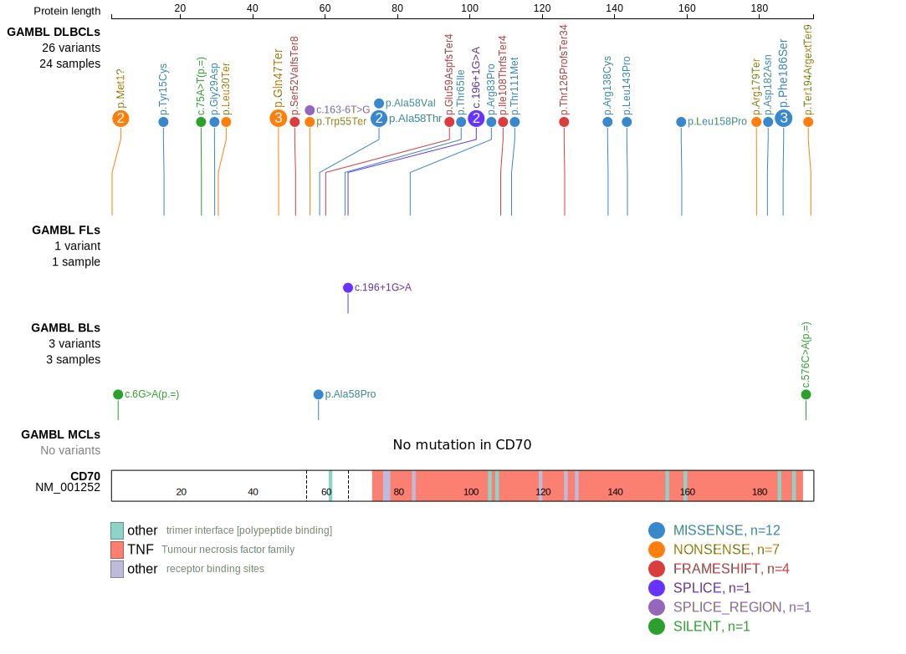

# CD70

## Overview
CD70 is a costimulatory molecule expressed on some activated lymphocytes and has a role in T-cell-mediated immune responses. 
CD70 aberrations are relatively common in DLBCL and appear more frequent in certain DLBCL patient populations. For instance, in a Chinese DLBCL cohort, 24% of cases exhibited CD70 genetic changes, compared to 10.8% in a Swedish cohort.[@nieDualRoleCD702022b]
CD70 mutations are associated with the BN2 genetic subtype of DLBCL.[@wrightProbabilisticClassificationTool2020] 
The mutation pattern in CD70 is consistent with the preferential accumulation of *inactivating mutations*. 
Genetic perturbation limits the development of an effective CD8+ T-cell immune response in Bcl6-driven DLBCL. [@nieDualRoleCD702022]
In mouse models, CD70 loss promoted lymphomagenesis, consistent with its role as a tumor suppressor gene in B-cell lymphomas.[@mandatoAbstractA38Cd702022]

## History

## Relevance tier by entity

|Entity|Tier|Description                           |
|:------:|:----:|--------------------------------------|
| |1   |high-confidence DLBCL gene            [@morinFrequentMutationHistonemodifying2011]|
|    |2   |relevance in FL not firmly established[@russler-germainMutationsAssociatedProgression2023]|

## Mutation incidence in large patient cohorts (GAMBL reanalysis)

|Entity|source               |frequency (%)|
|:------:|:---------------------:|:-------------:|
|DLBCL |GAMBL genomes        |5.54         |
|DLBCL |Schmitz cohort       |9.36         |
|DLBCL |Reddy cohort         |6.91         |
|DLBCL |Chapuy cohort        |7.69         |
|FL    |GAMBL genomes        |1.15         |
|BL    |GAMBL genomes+capture|0.92         |
|BL    |Thomas cohort        |0.40         |
|BL    |Panea cohort         |3.00         |

## Mutation pattern and selective pressure estimates

|Entity|aSHM|Significant selection|dN/dS (missense)|dN/dS (nonsense)|
|:------:|:----:|:---------------------:|:----------------:|:----------------:|
|BL    |No  |No                   | 2.199          |  0.000         |
|DLBCL |No  |Yes                  |28.493          |249.836         |
|FL    |No  |No                   | 0.000          |106.251         |

## CD70 Hotspots

| Chromosome |Coordinate (hg19) | ref>alt | HGVSp | 
 | :---:| :---: | :--: | :---: |
| chr19 | 6590145 | C>T | W55* |
| chr19 | 6590138 | C>T | A58T |
| chr19 | 6590138 | C>G | A58P |
| chr19 | 6590137 | G>A | A58V |
| chr19 | 6590116 | G>A | T65I |

View coding variants in ProteinPaint [hg19](https://morinlab.github.io/LLMPP/GAMBL/CD70_protein.html)  or [hg38](https://morinlab.github.io/LLMPP/GAMBL/CD70_protein_hg38.html)

View all variants in GenomePaint [hg19](https://morinlab.github.io/LLMPP/GAMBL/CD70.html)  or [hg38](https://morinlab.github.io/LLMPP/GAMBL/CD70_hg38.html)

## CD70 Expression

<!-- ORIGIN: morinFrequentMutationHistonemodifying2011 -->
<!-- DLBCL: morinFrequentMutationHistonemodifying2011 -->
<!-- FL: russler-germainMutationsAssociatedProgression2023b -->

## References

