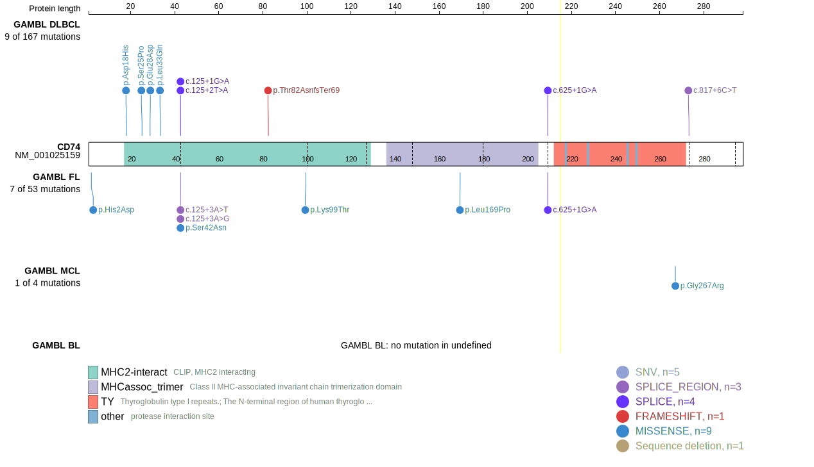
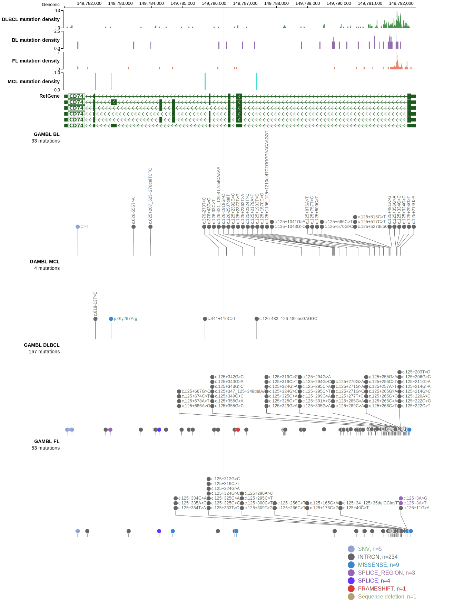

# [CD74]

## Mutation tier

|Entity|Tier|Description                              |
|:------:|:----:|-----------------------------------------|
|DLBCL |2-a | aSHM target; Although recurrent, the relevance of mutations in DLBCL is tenuous |
## Mutation incidence

|Entity|source        |frequency (%)|
|:------:|:--------------:|:-------------:|
|DLBCL |GAMBL genomes |2.29         |
|DLBCL |Schmitz cohort|2.55         |
|DLBCL |Reddy cohort  |1.60         |
|DLBCL |Chapuy cohort |0.85         |

## Mutation pattern

|Entity|aSHM|Significant selection|dN/dS (missense)|dN/dS (nonsense)|
|:------:|:----:|:---------------------:|:----------------:|:----------------:|
|BL    |Yes |No                   | 0.000          | 0.000          |
|DLBCL |Yes |No                   | 7.870          |13.428          |
|FL    |Yes |No                   |15.844          |34.375          |

## aSHM regions

|chr_name|hg19_start|hg19_end |region                                                                                     |regulatory_comment|
|:--------:|:----------:|:---------:|:-------------------------------------------------------------------------------------------:|:------------------:|
|chr5    |149790977 |149792349|[TSS](https://genome.ucsc.edu/s/rdmorin/GAMBL%20hg19?position=chr5%3A149790977%2D149792349)|active_promoter   |

> [!NOTE]
> First described in DLBCL in 2018 by [Arthur SE](https://pubmed.ncbi.nlm.nih.gov/30275490)

View coding variants in ProteinPaint [hg19](https://www.bcgsc.ca/downloads/morinlab/GAMBL/test/genes/CD74_protein.html)  or [hg38](https://www.bcgsc.ca/downloads/morinlab/GAMBL/test/genes/CD74_protein_hg38.html)

View all variants in GenomePaint [hg19](https://www.bcgsc.ca/downloads/morinlab/GAMBL/test/genes/CD74.html)  or [hg38](https://www.bcgsc.ca/downloads/morinlab/GAMBL/test/genes/CD74_hg38.html)

