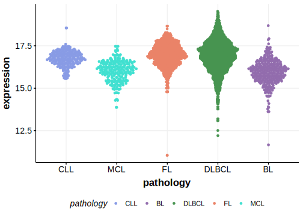

[[_TOC_]]

## Relevance tier by entity

[[include:table1_CD74.md]]

## Mutation incidence in large patient cohorts (GAMBL reanalysis)

[[include:DLBCL_CD74.md]]

## Mutation pattern and selective pressure estimates

[[include:dnds_CD74.md]]

## aSHM regions

|chr_name|hg19_start|hg19_end |region                                                                                     |regulatory_comment|
|:--------:|:----------:|:---------:|:-------------------------------------------------------------------------------------------:|:------------------:|
|chr5    |149790977 |149792349|[TSS](https://genome.ucsc.edu/s/rdmorin/GAMBL%20hg19?position=chr5%3A149790977%2D149792349)|active_promoter   |

[[include:browser_CD74.md]]

## Expression

<!-- ORIGIN: arthurGenomewideDiscoverySomatic2018 -->
<!-- DLBCL: arthurGenomewideDiscoverySomatic2018 -->

[[include:mermaid_CD74.md]]

## References
