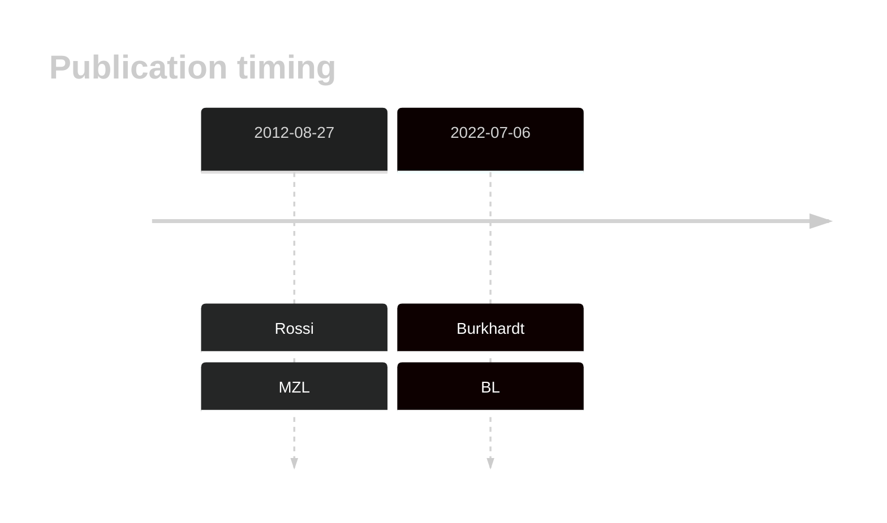
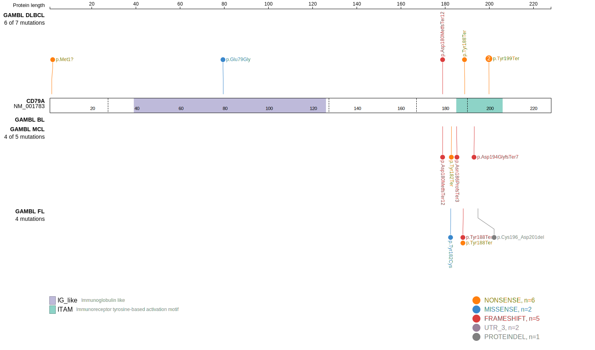
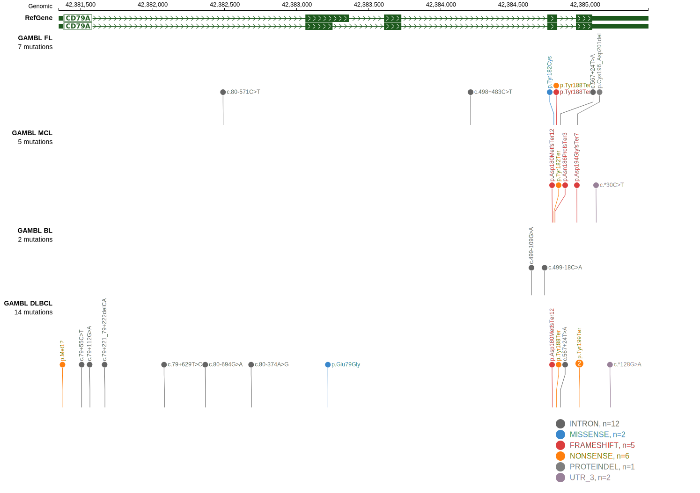
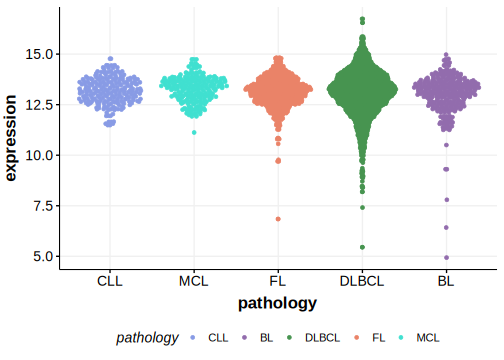

# CD79A

## History

## Relevance tier by entity

|Entity|Tier|Description                           |
|:------:|:----:|--------------------------------------|
||2|relevance in MZL not firmly established[@rossiCodingGenomeSplenic2012c]|
|    |2   |relevance in BL not firmly established[@burkhardtClinicalRelevanceMolecular2022b]|

## Mutation incidence in large patient cohorts (GAMBL reanalysis)

|Entity|source               |frequency (%)|
|:------:|:---------------------:|:-------------:|
|BL    |GAMBL genomes+capture|0.23         |
|BL    |Thomas cohort        |  NA         |
|BL    |Panea cohort         |  NA         |

## Mutation pattern and selective pressure estimates

|Entity|aSHM|Significant selection|dN/dS (missense)|dN/dS (nonsense)|
|:------:|:----:|:---------------------:|:----------------:|:----------------:|
|BL    |No  |No                   |0.000           | 0.000          |
|DLBCL |No  |No                   |1.810           |16.146          |
|FL    |No  |No                   |3.676           |33.801          |

## CD79A Hotspots

| Chromosome |Coordinate (hg19) | ref>alt | HGVSp | 
 | :---:| :---: | :--: | :---: |
| chr19 | 42384963 | T>A | Y199* |
| chr19 | 42384963 | T>G | Y199* |

View coding variants in ProteinPaint [hg19](https://morinlab.github.io/LLMPP/GAMBL/CD79A_protein.html)  or [hg38](https://morinlab.github.io/LLMPP/GAMBL/CD79A_protein_hg38.html)

View all variants in GenomePaint [hg19](https://morinlab.github.io/LLMPP/GAMBL/CD79A.html)  or [hg38](https://morinlab.github.io/LLMPP/GAMBL/CD79A_hg38.html)

## CD79A Expression

<!-- ORIGIN: rossiCodingGenomeSplenic2012c -->
<!-- BL: burkhardtClinicalRelevanceMolecular2022b -->
<!-- MZL: rossiCodingGenomeSplenic2012c -->

## References
1.  Rossi D, Trifonov V, Fangazio M, Bruscaggin A, Rasi S, Spina V, Monti S, Vaisitti T, Arruga F, Famà R, Ciardullo C, Greco M, Cresta S, Piranda D, Holmes A, Fabbri G, Messina M, Rinaldi A, Wang J, Agostinelli C, Piccaluga PP, Lucioni M, Tabbò F, Serra R, Franceschetti S, Deambrogi C, Daniele G, Gattei V, Marasca R, Facchetti F, Arcaini L, Inghirami G, Bertoni F, Pileri SA, Deaglio S, Foà R, Dalla-Favera R, Pasqualucci L, Rabadan R, Gaidano G. The coding genome of splenic marginal zone lymphoma: activation of NOTCH2 and other pathways regulating marginal zone development. J Exp Med. 2012 Aug 27;209(9):1537–1551. PMCID: PMC3428941
2.  Burkhardt B, Michgehl U, Rohde J, Erdmann T, Berning P, Reutter K, Rohde M, Borkhardt A, Burmeister T, Dave S, Tzankov A, Dugas M, Sandmann S, Fend F, Finger J, Mueller S, Gökbuget N, Haferlach T, Kern W, Hartmann W, Klapper W, Oschlies I, Richter J, Kontny U, Lutz M, Maecker-Kolhoff B, Ott G, Rosenwald A, Siebert R, von Stackelberg A, Strahm B, Woessmann W, Zimmermann M, Zapukhlyak M, Grau M, Lenz G. Clinical relevance of molecular characteristics in Burkitt lymphoma differs according to age. Nat Commun. 2022 Jul 6;13(1):3881. PMCID: PMC9259584
