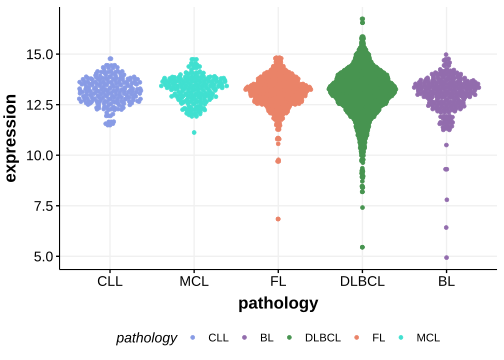

[[_TOC_]]

## Relevance tier by entity

[[include:tables/table1_CD79A.md]]

## Mutation incidence in large patient cohorts (GAMBL reanalysis)

### DLBCL
[[include:tables/DLBCL_CD79A.md]]

### FL
[[include:tables/FL_CD79A.md]]

### BL
[[include:tables/BL_CD79A.md]]

## Mutation pattern and selective pressure estimates

[[include:tables/dnds_CD79A.md]]

## CD79A Hotspots

| Chromosome |Coordinate (hg19) | ref>alt | HGVSp | 
 | :---:| :---: | :--: | :---: |
| chr19 | 42384963 | T>A | Y199* |
| chr19 | 42384963 | T>G | Y199* |

[[include:tables/browser_CD79A.md]]

## Expression

<!-- ORIGIN: rossiCodingGenomeSplenic2012c -->
<!-- BL: burkhardtClinicalRelevanceMolecular2022b -->
<!-- MZL: rossiCodingGenomeSplenic2012c -->

[[include:tables/mermaid_CD79A.md]]

## References

