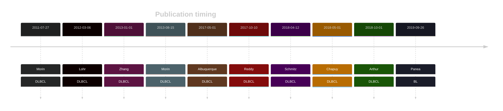
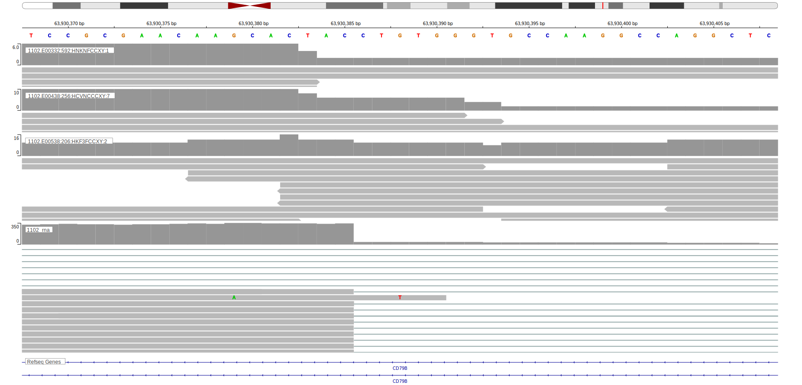
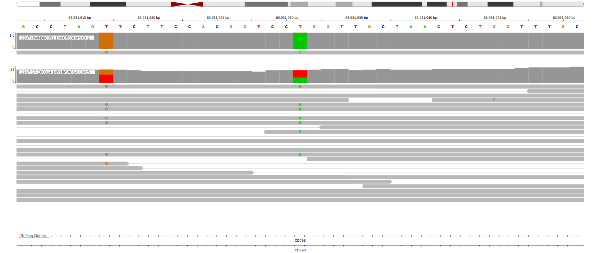

# CD79B

## Overview
CD79B mutations significantly contribute to the pathogenesis of DLBCL by enhancing BCR signaling and promoting tumor survival. 
These mutations, especially when co-occurring with MYD88 mutations, define a unique molecular subtype.[@wrightProbabilisticClassificationTool2020] 
This has clinical and therapeutic implications as it may contribute sensitivity to BTK inhibitors. 
In an inducible mouse model of MYD88-driven DLBCL, CD79B mutations did not accelerate lymphomagenesis but demonstrated an increased sensitivity to pharmacological BTK inhibition.[@flumannInducibleCd79bMutation2024] 
In a retrospective analysis, younger patients with MCD DLBCL that were treated with ibrutinib had significantly better outcomes.[@wilsonEffectIbrutinibRCHOP2021b]
The most common hotspot mutation in CD79B is at the tyrosine residue 196 (Y196). 
This and other common mutations primarily occur in the immunoreceptor tyrosine-based activation motif (ITAM) domain and prevent the negative regulatory feedback provided by Lyn kinase thereby enhancing BCR signaling.[@kimCD79BMYD88Mutations2014; @davisChronicActiveBcellreceptor2010]

## History

## Relevance tier by entity

|Entity|Tier|Description                           |
|:------:|:----:|--------------------------------------|
| |1-EE   |high-confidence DLBCL gene with functional evidence[@davisChronicActiveBcellreceptor2010]            [@morinFrequentMutationHistonemodifying2011]|
|    |2   |relevance in FL not firmly established|
|    |3   |Retired, Failed QC[@paneaWholeGenomeLandscape2019]|

## Mutation incidence in large patient cohorts (GAMBL reanalysis)

|Entity|source               |frequency (%)|
|:------:|:---------------------:|:-------------:|
|BL    |GAMBL genomes+capture| 1.39        |
|BL    |Thomas cohort        | 0.00        |
|BL    |Panea cohort         | 4.00        |
|DLBCL |GAMBL genomes        | 9.94        |
|DLBCL |Schmitz cohort       |14.89        |
|DLBCL |Reddy cohort         | 8.31        |
|DLBCL |Chapuy cohort        |15.38        |
|FL    |GAMBL genomes        | 2.77        |

## Mutation pattern and selective pressure estimates

|Entity|aSHM|Significant selection|dN/dS (missense)|dN/dS (nonsense)|
|:------:|:----:|:---------------------:|:----------------:|:----------------:|
|BL    |No  |No                   | 0.000          | 0.000          |
|DLBCL |No  |Yes                  |16.616          |41.932          |
|FL    |No  |No                   |10.310          | 0.000          |

## CD79B Hotspots

Mutations at Y196 enhance B-cell receptor (BCR) signaling by preventing the negative regulatory feedback provided by Lyn kinase, a feedback inhibitor of BCR signaling. This results in continuous activation of the NF-κB pathway, promoting tumor cell survival and proliferation.4

| Chromosome |Coordinate (hg19) | ref>alt | HGVSp | 
 | :---:| :---: | :--: | :---: |
| chr17 | 62007234 | C>G | A150P |
| chr17 | 62007234 | C>T | A150T |
| chr17 | 62007233 | G>A | A150V |
| chr17 | 62007140 | A>G | L181P |
| chr17 | 62007129 | C>T | X184_splice |
| chr17 | 62006798 | T>A | Y197F |
| chr17 | 62006798 | T>C | Y197C |
| chr17 | 62006799 | A>C | Y197D |
| chr17 | 62006799 | A>G | Y197H |
| chr17 | 62006798 | T>G | Y197S |
| chr17 | 62006795 | T>C | E198G |
| chr17 | 62006680 | A>G | L200P |
| chr17 | 62006680 | A>C | L200R |
| chr17 | 62006680 | A>T | L200Q |
| chr17 | 62006603 | G>A | H226Y |
| chr17 | 62006603 | G>T | H226N |

View coding variants in ProteinPaint [hg19](https://morinlab.github.io/LLMPP/GAMBL/CD79B_protein.html)  or [hg38](https://morinlab.github.io/LLMPP/GAMBL/CD79B_protein_hg38.html)

View all variants in GenomePaint [hg19](https://morinlab.github.io/LLMPP/GAMBL/CD79B.html)  or [hg38](https://morinlab.github.io/LLMPP/GAMBL/CD79B_hg38.html)

## CD79B Expression

## Representative Mutations

### BL

**Rating**
&star; &star; &star; &star; &star;

**Rating**
&starf; &starf; &starf; &star; &star;

## References
<!-- ORIGIN: morinFrequentMutationHistonemodifying2011 -->
<!-- DLBCL: morinFrequentMutationHistonemodifying2011 -->
<!-- BL: paneaWholeGenomeLandscape2019 -->
