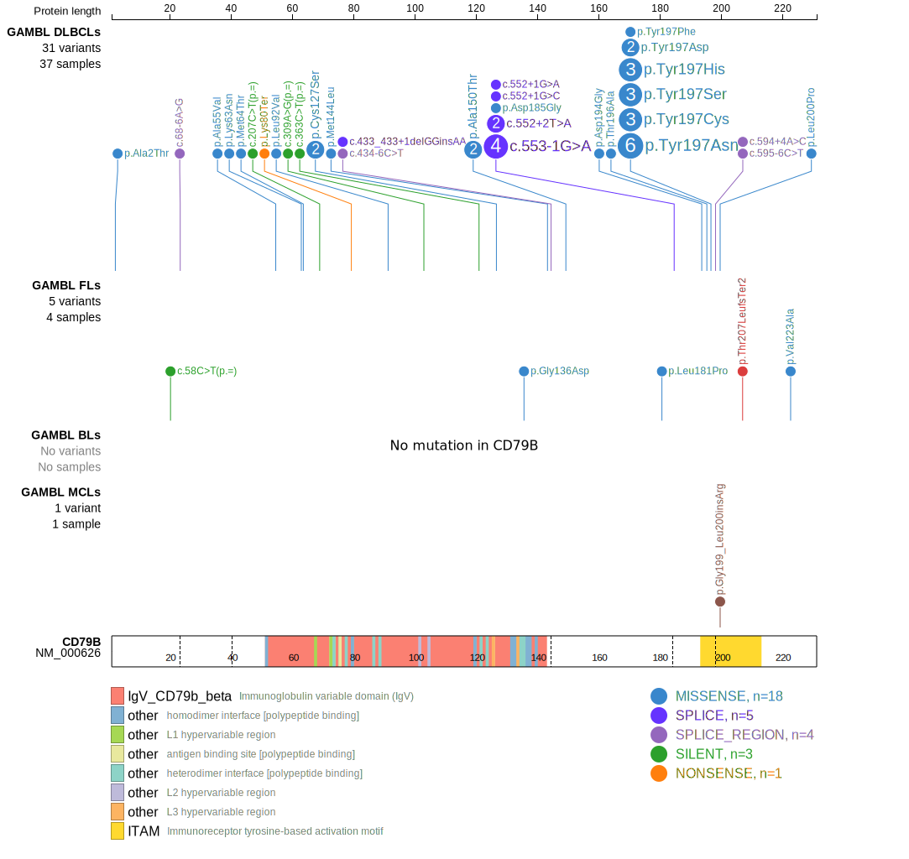
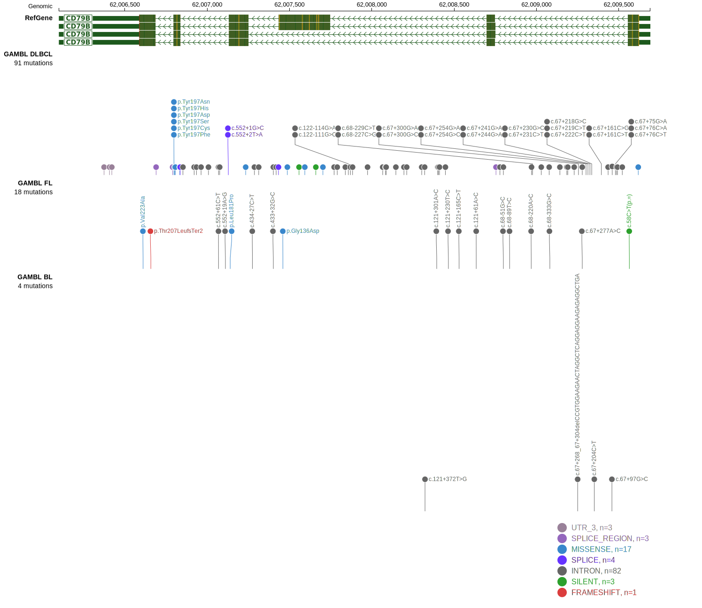
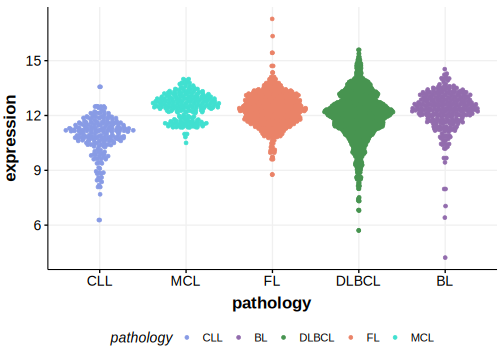

# CD79B
## Overview
CD79B mutations significantly contribute to the pathogenesis of DLBCL by enhancing BCR signaling and promoting tumor survival. These mutations, especially when co-occurring with MYD88 mutations, define a unique molecular subtype.1 This has clinical and therapeutic implications as it may contribute sensitivity to BTK inhibitors. In an inducible mouse model of MYD88-driven DLBCL, CD79B mutations did not accelerate lymphomagenesis but demonstrated an increased sensitivity to pharmacological BTK inhibition.2 In a retrospective analysis, younger patients with MCD DLBCL that were treated with ibrutinib had significantly better outcomes.3 The most common hotspot mutation in CD79B is at the tyrosine residue 196 (Y196). This and other common mutations primarily occur in the immunoreceptor tyrosine-based activation motif (ITAM) domain and prevent the negative regulatory feedback provided by Lyn kinase thereby enhancing BCR signaling.  

## Relevance tier by entity

|Entity|Tier|Description                           |
|:------:|:----:|--------------------------------------|
|BL    |2   |relevance in BL not firmly established|
|DLBCL |1   |high-confidence DLBCL gene            |
|FL    |2   |relevance in FL not firmly established|

## Mutation incidence in large patient cohorts (GAMBL reanalysis)

|Entity|source               |frequency (%)|
|:------:|:---------------------:|:-------------:|
|BL    |GAMBL genomes+capture| 1.39        |
|BL    |Thomas cohort        | 0.00        |
|BL    |Panea cohort         | 4.00        |
|DLBCL |GAMBL genomes        | 9.94        |
|DLBCL |Schmitz cohort       |14.89        |
|DLBCL |Reddy cohort         | 8.31        |
|DLBCL |Chapuy cohort        |15.38        |
|FL    |GAMBL genomes        | 2.77        |

## Mutation pattern and selective pressure estimates

|Entity|aSHM|Significant selection|dN/dS (missense)|dN/dS (nonsense)|
|:------:|:----:|:---------------------:|:----------------:|:----------------:|
|BL    |No  |No                   | 0.000          | 0.000          |
|DLBCL |No  |Yes                  |16.616          |41.932          |
|FL    |No  |No                   |10.310          | 0.000          |

 ## CD79B Hotspots

Mutations at Y196 enhance B-cell receptor (BCR) signaling by preventing the negative regulatory feedback provided by Lyn kinase, a feedback inhibitor of BCR signaling. This results in continuous activation of the NF-κB pathway, promoting tumor cell survival and proliferation.4

| Chromosome |Coordinate (hg19) | ref>alt | HGVSp | 
 | :---:| :---: | :--: | :---: |
| chr17 | 62007234 | C>G | A150P |
| chr17 | 62007234 | C>T | A150T |
| chr17 | 62007233 | G>A | A150V |
| chr17 | 62007140 | A>G | L181P |
| chr17 | 62007129 | C>T | X184_splice |
| chr17 | 62006798 | T>A | Y197F |
| chr17 | 62006798 | T>C | Y197C |
| chr17 | 62006799 | A>C | Y197D |
| chr17 | 62006799 | A>G | Y197H |
| chr17 | 62006798 | T>G | Y197S |
| chr17 | 62006795 | T>C | E198G |
| chr17 | 62006680 | A>G | L200P |
| chr17 | 62006680 | A>C | L200R |
| chr17 | 62006680 | A>T | L200Q |
| chr17 | 62006603 | G>A | H226Y |
| chr17 | 62006603 | G>T | H226N |

View coding variants in ProteinPaint [hg19](https://morinlab.github.io/LLMPP/GAMBL/CD79B_protein.html)  or [hg38](https://morinlab.github.io/LLMPP/GAMBL/CD79B_protein_hg38.html)

View all variants in GenomePaint [hg19](https://morinlab.github.io/LLMPP/GAMBL/CD79B.html)  or [hg38](https://morinlab.github.io/LLMPP/GAMBL/CD79B_hg38.html)

## CD79B Expression

## References
1. *Wright GW, Huang DW, Phelan JD, Coulibaly ZA, Roulland S, Young RM, Wang JQ, Schmitz R, Morin RD, Tang J, Jiang A, Bagaev A, Plotnikova O, Kotlov N, Johnson CA, Wilson WH, Scott DW, Staudt LM. A Probabilistic Classification Tool for Genetic Subtypes of Diffuse Large B Cell Lymphoma with Therapeutic Implications. Cancer Cell. 2020 Apr 13;37(4):551-568.e14. doi: 10.1016/j.ccell.2020.03.015. PMID: 32289277; PMCID: PMC8459709.*
2. *Flümann R, Hansen J, Meinel J, Pfeiffer P, Goldfarb Wittkopf H, Lütz A, Wirtz J, Möllmann M, Zhou T, Tabatabai A, Lohmann T, Jauch M, Beleggia F, Pelzer B, Ullrich F, Höfmann S, Arora A, Persigehl T, Büttner R, von Tresckow B, Klein S, Jachimowicz RD, Reinhardt HC, Knittel G. An inducible Cd79b mutation confers ibrutinib sensitivity in mouse models of Myd88-driven diffuse large B-cell lymphoma. Blood Adv. 2024 Mar 12;8(5):1063-1074. doi: 10.1182/bloodadvances.2023011213. PMID: 38060829; PMCID: PMC10907402.*
3. *Wilson WH, Wright GW, Huang DW, Hodkinson B, Balasubramanian S, Fan Y, Vermeulen J, Shreeve M, Staudt LM. Effect of ibrutinib with R-CHOP chemotherapy in genetic subtypes of DLBCL. Cancer Cell. 2021 Dec 13;39(12):1643-1653.e3. doi: 10.1016/j.ccell.2021.10.006. Epub 2021 Nov 4. PMID: 34739844; PMCID: PMC8722194.*
4. *Kim Y, Ju H, Kim DH, Yoo HY, Kim SJ, Kim WS, Ko YH. CD79B and MYD88 mutations in diffuse large B-cell lymphoma. Hum Pathol. 2014 Mar;45(3):556-64. doi: 10.1016/j.humpath.2013.10.023. Epub 2013 Oct 31. PMID: 24444466.*
<!-- ORIGIN: morinFrequentMutationHistonemodifying2011 -->
<!-- DLBCL: morinFrequentMutationHistonemodifying2011 -->
