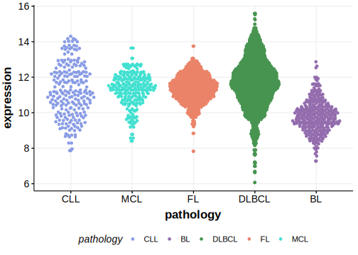
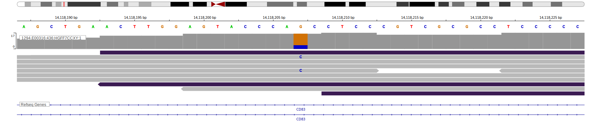
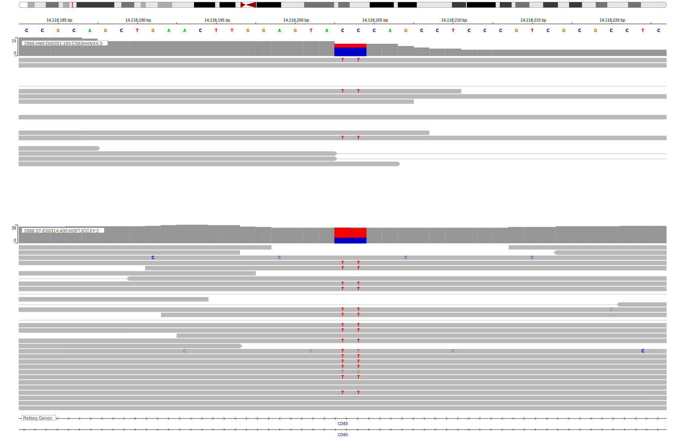

[[_TOC_]]

## Overview

CD83 is a transmembrane protein that plays a role in the immune system, particularly in the maturation and function of dendritic cells, T cells, and B cells with a role in regulating immune responses and maintaining immune tolerance. 
CD83 mutations in B-cell lymphomas have not been as extensively studied as mutations in some other genes. CD83 is one of [a number of genes](https://github.com/morinlab/LLMPP/wiki/ashm) affected by aberrant somatic hypermutation in B-cell lymphomas, which complicates the interpretation of mutations at this locus.
No notable hot spots have been described in this gene in the context of the cancers listed below. 

Mutations in this gene were first described in DLBCL in 2013 by Morin et al[@morinMutationalStructuralAnalysis2013], in BL in 2019 by Panea et al[@paneaWholeGenomeLandscape2019] and in FL in 2023 by Russler-Germain et al.[@russler-germainMutationsAssociatedProgression2023]

## Relevance tier by entity

|Entity|Tier|Description                           |
|:------:|:----:|--------------------------------------|
||1|high-confidence PMBL/cHL/GZL gene[@dunsCharacterizationDLBCLPMBL2021]|
| |1 | aSHM target and high-confidence DLBCL gene            [@morinMutationalStructuralAnalysis2013; @schmitzGeneticsPathogenesisDiffuse2018; @reddyGeneticFunctionalDrivers2017]|
|    |1 | aSHM target and high-confidence FL gene               [@russler-germainMutationsAssociatedProgression2023]|
|    |2 | aSHM target; Although recurrent, the relevance of mutations in BL is tenuous [@paneaWholeGenomeLandscape2019]|

## Mutation incidence in large patient cohorts (GAMBL reanalysis)

[[include:DLBCL_CD83.md]]
[[include:FL_CD83.md]]

## Mutation pattern and selective pressure estimates

[[include:dnds_CD83.md]]

## aSHM regions

|chr_name|hg19_start|hg19_end|region                                                                                   |regulatory_comment             |
|:--------:|:----------:|:--------:|:-----------------------------------------------------------------------------------------:|:-------------------------------:|
|chr6    |14118026  |14120025|[TSS](https://genome.ucsc.edu/s/rdmorin/GAMBL%20hg19?position=chr6%3A14118026%2D14120025)|active_promoter-strong_enhancer|

[[include:browser_CD83.md]]

## Expression

## Representative Mutations

### BL

**Rating**
&starf; &star; &star; &star; &star;

**Rating**
&starf; &starf; &starf; &starf; &star;

[[include:mermaid_CD83.md]]

## References
<!-- ORIGIN: morinMutationalStructuralAnalysis2013 -->
<!-- BL: paneaWholeGenomeLandscape2019 -->
<!-- FL: russler-germainMutationsAssociatedProgression2023b -->
<!-- BL: paneaWholeGenomeLandscape2019 -->
<!-- DLBCL: morinMutationalStructuralAnalysis2013 -->
<!-- PMBL: dunsCharacterizationDLBCLPMBL2021b -->
