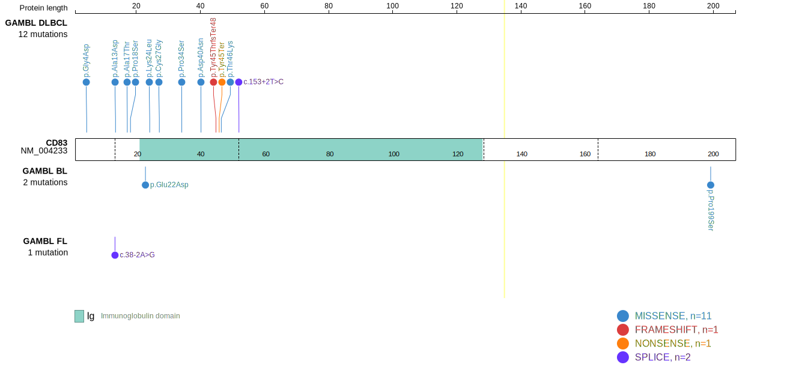
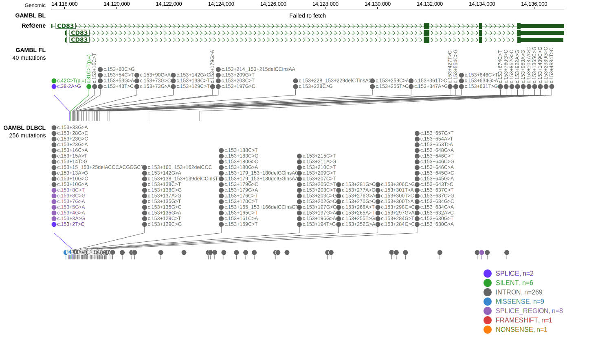

# CD83
## Overview

CD83 is a transmembrane protein that plays a role in the immune system, particularly in the maturation and function of dendritic cells, T cells, and B cells with a role in regulating immune responses and maintaining immune tolerance.1 CD83 mutations in B-cell lymphomas have not been as extensively studied as mutations in some other genes. CD83 is one of [a number of genes](https://github.com/morinlab/LLMPP/wiki/ashm) affected by aberrant somatic hypermutation in B-cell lymphomas, which complicates the interpretation of mutations at this locus. 

## Relevance tier by entity

|Entity|Tier|Description                           |
|:------:|:----:|--------------------------------------|
|DLBCL |1-a | aSHM target and high-confidence DLBCL gene            |
|FL    |1-a | aSHM target and high-confidence FL gene               |
|BL    |2-a | aSHM target; Although recurrent, the relevance of mutations in BL is tenuous |

## Mutation incidence in large patient cohorts (GAMBL reanalysis)

|Entity|source               |frequency (%)|
|:------:|:---------------------:|:-------------:|
|DLBCL |GAMBL genomes        |4.40         |
|DLBCL |Schmitz cohort       |5.74         |
|DLBCL |Reddy cohort         |5.81         |
|DLBCL |Chapuy cohort        |7.26         |
|FL    |GAMBL genomes        |1.85         |
|BL    |GAMBL genomes+capture|1.15         |
|BL    |Thomas cohort        |1.70         |
|BL    |Panea cohort         |  NA         |

## Mutation pattern and selective pressure estimates

|Entity|aSHM|Significant selection|dN/dS (missense)|dN/dS (nonsense)|
|:------:|:----:|:---------------------:|:----------------:|:----------------:|
|BL    |Yes |No                   |4.396           | 0.000          |
|DLBCL |Yes |No                   |4.794           |14.227          |
|FL    |Yes |No                   |0.000           |25.732          |

## aSHM regions

|chr_name|hg19_start|hg19_end|region                                                                                   |regulatory_comment             |
|:--------:|:----------:|:--------:|:-----------------------------------------------------------------------------------------:|:-------------------------------:|
|chr6    |14118026  |14120025|[TSS](https://genome.ucsc.edu/s/rdmorin/GAMBL%20hg19?position=chr6%3A14118026%2D14120025)|active_promoter-strong_enhancer|

> [!NOTE]
> First described in BL in 2019 by [Panea RI](https://pubmed.ncbi.nlm.nih.gov/31558468). First described in DLBCL in 2013.2 First described in FL in 2023.3

View coding variants in ProteinPaint [hg19](https://morinlab.github.io/LLMPP/GAMBL/CD83_protein.html)  or [hg38](https://morinlab.github.io/LLMPP/GAMBL/CD83_protein_hg38.html)

View all variants in GenomePaint [hg19](https://morinlab.github.io/LLMPP/GAMBL/CD83.html)  or [hg38](https://morinlab.github.io/LLMPP/GAMBL/CD83_hg38.html)

## References
1. *Lechmann M, Zinser E, Golka A, Steinkasserer A. Role of CD83 in the immunomodulation of dendritic cells. Int Arch Allergy Immunol. 2002 Oct;129(2):113-8. doi: 10.1159/000065883. PMID: 12403928.*
2. *Morin RD, Mungall K, Pleasance E, Mungall AJ, Goya R, Huff RD, Scott DW, Ding J, Roth A, Chiu R, Corbett RD, Chan FC, Mendez-Lago M, Trinh DL, Bolger-Munro M, Taylor G, Hadj Khodabakhshi A, Ben-Neriah S, Pon J, Meissner B, Woolcock B, Farnoud N, Rogic S, Lim EL, Johnson NA, Shah S, Jones S, Steidl C, Holt R, Birol I, Moore R, Connors JM, Gascoyne RD, Marra MA. Mutational and structural analysis of diffuse large B-cell lymphoma using whole-genome sequencing. Blood. 2013 Aug 15;122(7):1256-65. doi: 10.1182/blood-2013-02-483727. Epub 2013 May 22. PMID: 23699601; PMCID: PMC3744992.*
3. *Russler-Germain DA, Krysiak K, Ramirez C, Mosior M, Watkins MP, Gomez F, Skidmore ZL, Trani L, Gao F, Geyer S, Cashen AF, Mehta-Shah N, Kahl BS, Bartlett NL, Alderuccio JP, Lossos IS, Ondrejka SL, Hsi ED, Martin P, Leonard JP, Griffith M, Griffith OL, Fehniger TA. Mutations associated with progression in follicular lymphoma predict inferior outcomes at diagnosis: Alliance A151303. Blood Adv. 2023 Sep 26;7(18):5524-5539. doi: 10.1182/bloodadvances.2023010779. PMID: 37493986; PMCID: PMC10514406.*