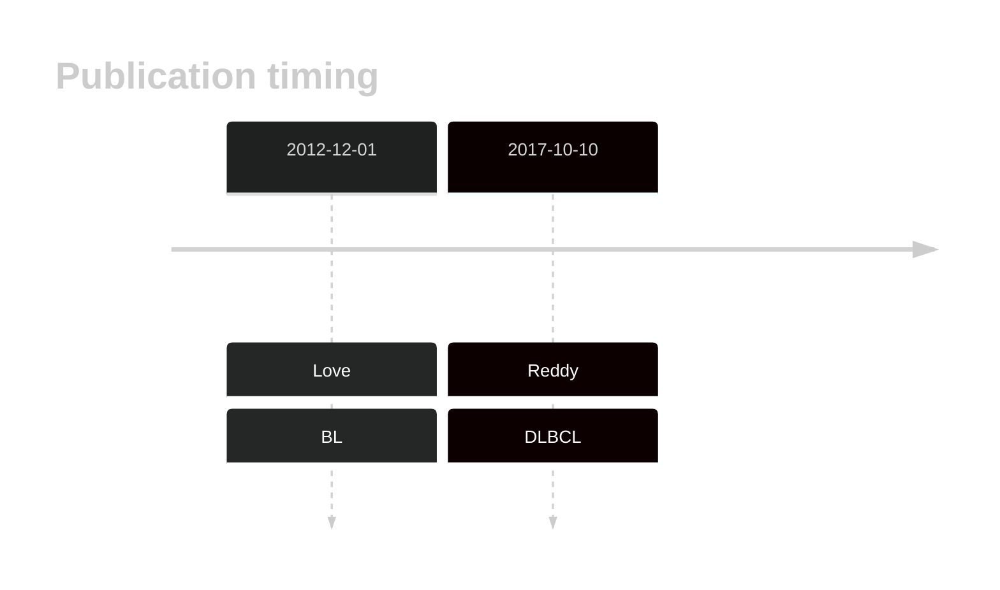

# CDC73

## History
Mutations in this gene were first described in BL in 2012 by Love et al1 and subsequently in DLBCL by Reddy et al.2 Subsequent exome and genome-wide studies of DLBCL and BL did not reproduce these observations. 

## Relevance tier by entity

|Entity|Tier|Description                              |
|:------:|:----:|-----------------------------------------|
|    |2   |relevance in BL not firmly established   |
| |2   |relevance in DLBCL not firmly established|

## Mutation incidence in large patient cohorts (GAMBL reanalysis)

|Entity|source               |frequency (%)|
|:------:|:---------------------:|:-------------:|
|BL    |GAMBL genomes+capture|2.54         |
|BL    |Thomas cohort        |  NA         |
|BL    |Panea cohort         |  NA         |
|DLBCL |GAMBL genomes        |0.57         |
|DLBCL |Schmitz cohort       |0.64         |
|DLBCL |Reddy cohort         |0.70         |
|DLBCL |Chapuy cohort        |1.28         |

## Mutation pattern and selective pressure estimates

|Entity|aSHM|Significant selection|dN/dS (missense)|dN/dS (nonsense)|
|:------:|:----:|:---------------------:|:----------------:|:----------------:|
|BL    |No  |No                   |3.951           |0               |
|DLBCL |No  |No                   |1.702           |0               |
|FL    |No  |No                   |3.603           |0               |

View coding variants in ProteinPaint [hg19](https://morinlab.github.io/LLMPP/GAMBL/CDC73_protein.html)  or [hg38](https://morinlab.github.io/LLMPP/GAMBL/CDC73_protein_hg38.html)

View all variants in GenomePaint [hg19](https://morinlab.github.io/LLMPP/GAMBL/CDC73.html)  or [hg38](https://morinlab.github.io/LLMPP/GAMBL/CDC73_hg38.html)

## CDC73 Expression

## Representative Mutations
### BL

**Rating**
&starf; &starf; &starf; &star; &star;

### DLBCL

**Rating**
&starf; &star; &star; &star; &star;

## References
1. *Love C, Sun Z, Jima D, Li G, Zhang J, Miles R, Richards KL, Dunphy CH, Choi WWL, Srivastava G, Lugar PL, Rizzieri DA, Lagoo AS, Bernal-Mizrachi L, Mann KP, Flowers CR, Naresh KN, Evens AM, Chadburn A, Gordon LI, Czader MB, Gill JI, Hsi ED, Greenough A, Moffitt AB, McKinney M, Banerjee A, Grubor V, Levy S, Dunson DB, Dave SS. The genetic landscape of mutations in Burkitt lymphoma. Nat Genet. 2012 Dec;44(12):1321–1325. PMCID: PMC3674561*

2.  *Reddy A, Zhang J, Davis NS, Moffitt AB, Love CL, Waldrop A, Leppa S, Pasanen A, Meriranta L, Karjalainen-Lindsberg ML, Nørgaard P, Pedersen M, Gang AO, Høgdall E, Heavican TB, Lone W, Iqbal J, Qin Q, Li G, Kim SY, Healy J, Richards KL, Fedoriw Y, Bernal-Mizrachi L, Koff JL, Staton AD, Flowers CR, Paltiel O, Goldschmidt N, Calaminici M, Clear A, Gribben J, Nguyen E, Czader MB, Ondrejka SL, Collie A, Hsi ED, Tse E, Au-Yeung RKH, Kwong YL, Srivastava G, Choi WWL, Evens AM, Pilichowska M, Sengar M, Reddy N, Li S, Chadburn A, Gordon LI, Jaffe ES, Levy S, Rempel R, Tzeng T, Happ LE, Dave T, Rajagopalan D, Datta J, Dunson DB, Dave SS. Genetic and Functional Drivers of Diffuse Large B Cell Lymphoma. Cell. 2017 Oct;171(2):481-494.e15.* 

<!-- ORIGIN: loveGeneticLandscapeMutations2012 -->
<!-- BL: loveGeneticLandscapeMutations2012 -->
<!-- DLBCL: reddyGeneticFunctionalDrivers2017 -->
