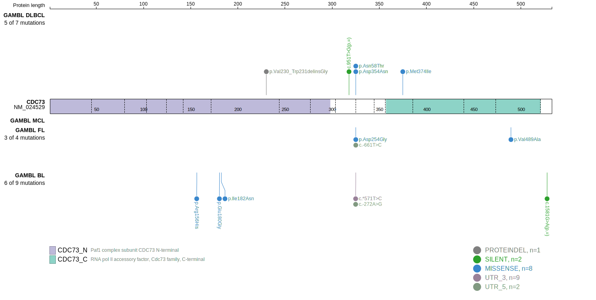
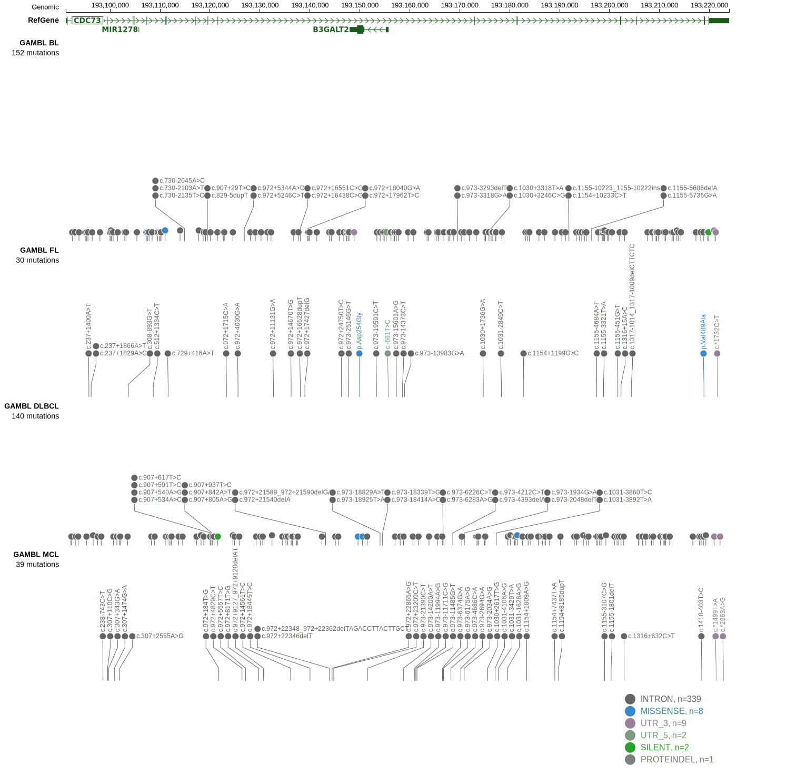
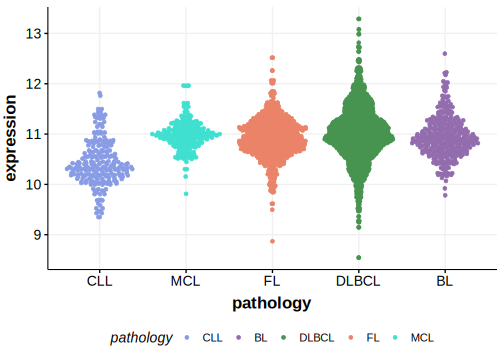

# CDC73

## Relevance tier by entity

|Entity|Tier|Description                              |
|:------:|:----:|-----------------------------------------|
|BL    |2   |relevance in BL not firmly established   |
|DLBCL |2   |relevance in DLBCL not firmly established|

## Mutation incidence in large patient cohorts (GAMBL reanalysis)

|Entity|source               |frequency (%)|
|:------:|:---------------------:|:-------------:|
|BL    |GAMBL genomes+capture|2.54         |
|BL    |Thomas cohort        |  NA         |
|BL    |Panea cohort         |  NA         |
|DLBCL |GAMBL genomes        |0.57         |
|DLBCL |Schmitz cohort       |0.64         |
|DLBCL |Reddy cohort         |0.70         |
|DLBCL |Chapuy cohort        |1.28         |

## Mutation pattern and selective pressure estimates

|Entity|aSHM|Significant selection|dN/dS (missense)|dN/dS (nonsense)|
|:------:|:----:|:---------------------:|:----------------:|:----------------:|
|BL    |No  |No                   |3.951           |0               |
|DLBCL |No  |No                   |1.702           |0               |
|FL    |No  |No                   |3.603           |0               |

> [!NOTE]
> First described in BL in 2012 by [Love C](https://pubmed.ncbi.nlm.nih.gov/23143597). First described in DLBCL in 2017 by [Reddy A](https://pubmed.ncbi.nlm.nih.gov/28985567)

View coding variants in ProteinPaint [hg19](https://morinlab.github.io/LLMPP/GAMBL/CDC73_protein.html)  or [hg38](https://morinlab.github.io/LLMPP/GAMBL/CDC73_protein_hg38.html)

View all variants in GenomePaint [hg19](https://morinlab.github.io/LLMPP/GAMBL/CDC73.html)  or [hg38](https://morinlab.github.io/LLMPP/GAMBL/CDC73_hg38.html)

## CDC73 Expression

