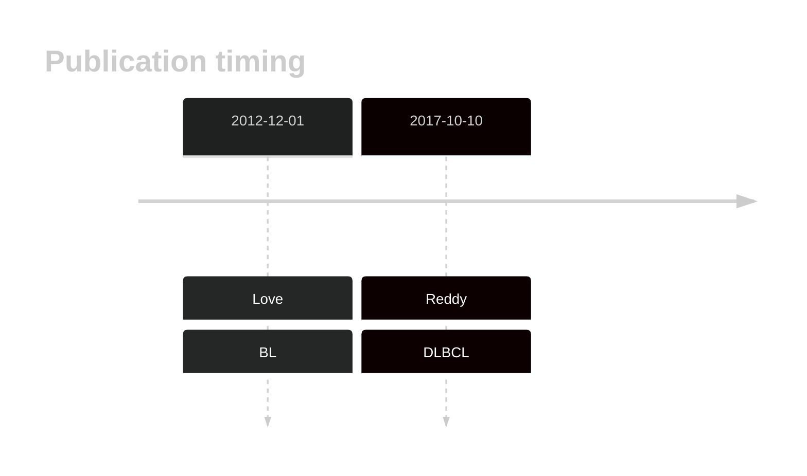
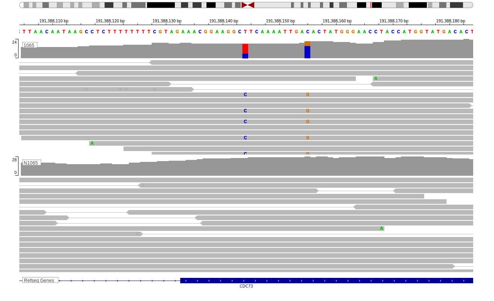

# CDC73

<<Warn("The variants reported in this gene in DLBCL failed QC")>>

## History
Mutations in this gene were first described in BL in 2012 by Love et al1 and subsequently in DLBCL by Reddy et al.2 Subsequent exome and genome-wide studies of DLBCL and BL did not reproduce these observations. 

## Relevance tier by entity

|Entity|Tier|Description                              |
|:------:|:----:|-----------------------------------------|
|    |2   |relevance in BL not firmly established   [@loveGeneticLandscapeMutations2012]|
| |2   |relevance in DLBCL not firmly established[@reddyGeneticFunctionalDrivers2017]|

## Mutation incidence in large patient cohorts (GAMBL reanalysis)

|Entity|source               |frequency (%)|
|:------:|:---------------------:|:-------------:|
|BL    |GAMBL genomes+capture|2.54         |
|BL    |Thomas cohort        |  NA         |
|BL    |Panea cohort         |  NA         |
|DLBCL |GAMBL genomes        |0.57         |
|DLBCL |Schmitz cohort       |0.64         |
|DLBCL |Reddy cohort         |0.70         |
|DLBCL |Chapuy cohort        |1.28         |

## Mutation pattern and selective pressure estimates

|Entity|aSHM|Significant selection|dN/dS (missense)|dN/dS (nonsense)|
|:------:|:----:|:---------------------:|:----------------:|:----------------:|
|BL    |No  |No                   |3.951           |0               |
|DLBCL |No  |No                   |1.702           |0               |
|FL    |No  |No                   |3.603           |0               |

View coding variants in ProteinPaint [hg19](https://morinlab.github.io/LLMPP/GAMBL/CDC73_protein.html)  or [hg38](https://morinlab.github.io/LLMPP/GAMBL/CDC73_protein_hg38.html)

View all variants in GenomePaint [hg19](https://morinlab.github.io/LLMPP/GAMBL/CDC73.html)  or [hg38](https://morinlab.github.io/LLMPP/GAMBL/CDC73_hg38.html)

## CDC73 Expression

## Representative Mutations

### BL

**Rating**
&starf; &starf; &starf; &star; &star;

### DLBCL

**Rating**
&starf; &star; &star; &star; &star;

## All Mutations

### BL

[1065](https://www.bcgsc.ca/downloads/morinlab/GAMBL/Love/1065_reports.html)
[1065](https://www.bcgsc.ca/downloads/morinlab/GAMBL/Love/1065_reports.html)
[847](https://www.bcgsc.ca/downloads/morinlab/GAMBL/Love/847_reports.html)

## References

<!-- ORIGIN: loveGeneticLandscapeMutations2012 -->
<!-- BL: loveGeneticLandscapeMutations2012 -->
<!-- DLBCL: reddyGeneticFunctionalDrivers2017 -->
