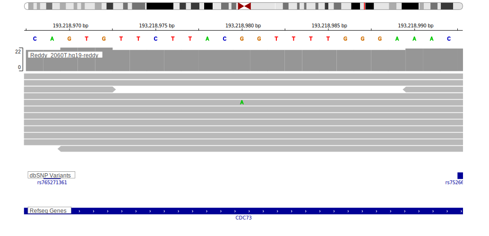

[[_TOC_]]

## Overview

Mutations in this gene were first described in BL in 2012 by Love et al[@loveGeneticLandscapeMutations2012] and subsequently in DLBCL by Reddy et al.[@reddyGeneticFunctionalDrivers2017] Subsequent exome and genome-wide studies of DLBCL and BL did not reproduce these observations. 

## Relevance tier by entity

|Entity|Tier|Description                              |
|:------:|:----:|-----------------------------------------|
|    |2   |relevance in BL not firmly established   [@loveGeneticLandscapeMutations2012]|
| |2   |relevance in DLBCL not firmly established[@reddyGeneticFunctionalDrivers2017]|

## Warnings

<<Warn("The variants reported in this gene in DLBCL failed QC")>>

## Mutation incidence in large patient cohorts (GAMBL reanalysis)

|Entity|source               |frequency (%)|
|:------:|:---------------------:|:-------------:|
|BL    |GAMBL genomes+capture|2.54         |
|BL    |Thomas cohort        |  NA         |
|BL    |Panea cohort         |  NA         |
|DLBCL |GAMBL genomes        |0.57         |
|DLBCL |Schmitz cohort       |0.64         |
|DLBCL |Reddy cohort         |0.70         |
|DLBCL |Chapuy cohort        |1.28         |

## Mutation pattern and selective pressure estimates

[[include:dnds_CDC73.md]]

[[include:browser_CDC73.md]]

## Expression

## Representative Mutations

### BL

**Rating**
&starf; &starf; &starf; &star; &star;

### DLBCL

**Rating**
&starf; &star; &star; &star; &star;

## All Mutations

### BL

[1065](https://www.bcgsc.ca/downloads/morinlab/GAMBL/Love/1065_reports.html)
[1065](https://www.bcgsc.ca/downloads/morinlab/GAMBL/Love/1065_reports.html)
[847](https://www.bcgsc.ca/downloads/morinlab/GAMBL/Love/847_reports.html)

[[include:mermaid_CDC73.md]]

## References

<!-- ORIGIN: loveGeneticLandscapeMutations2012 -->
<!-- BL: loveGeneticLandscapeMutations2012 -->
<!-- DLBCL: reddyGeneticFunctionalDrivers2017 -->
