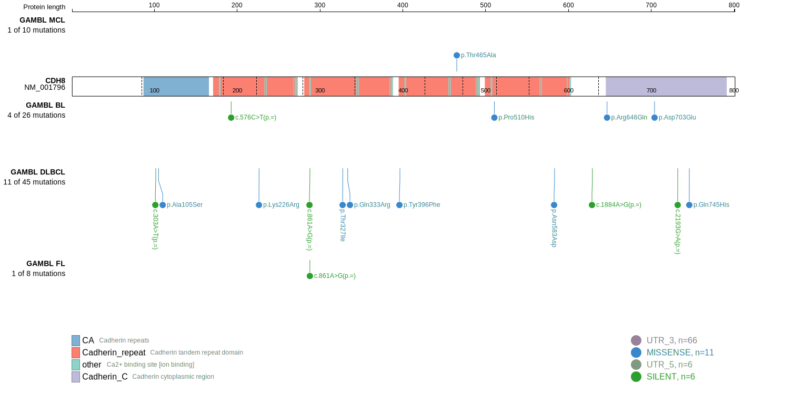
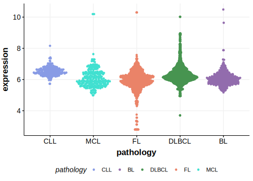

[[_TOC_]]

## Relevance tier by entity

|Entity|Tier|Description                            |
|:------:|:----:|---------------------------------------|
|   |2   |relevance in MCL not firmly established[@zhangGenomicLandscapeMantle2014]|

## Mutation incidence in large patient cohorts (GAMBL reanalysis)

|Entity|source       |frequency (%)|
|:------:|:-------------:|:-------------:|
|MCL   |GAMBL genomes|0.47         |

## Mutation pattern and selective pressure estimates

|Entity|aSHM|Significant selection|dN/dS (missense)|dN/dS (nonsense)|
|:------:|:----:|:---------------------:|:----------------:|:----------------:|
|BL    |No  |No                   |2.176           |0.00            |
|DLBCL |No  |No                   |0.926           |3.68            |
|FL    |No  |No                   |0.000           |0.00            |

View coding variants in ProteinPaint [hg19](https://morinlab.github.io/LLMPP/GAMBL/CDH8_protein.html)  or [hg38](https://morinlab.github.io/LLMPP/GAMBL/CDH8_protein_hg38.html)

View all variants in GenomePaint [hg19](https://morinlab.github.io/LLMPP/GAMBL/CDH8.html)  or [hg38](https://morinlab.github.io/LLMPP/GAMBL/CDH8_hg38.html)

## CDH8 Expression

<!-- ORIGIN: zhangGenomicLandscapeMantle2014 -->
<!-- MCL: zhangGenomicLandscapeMantle2014 -->

[[include:mermaid_CDH8.md]]

## References
