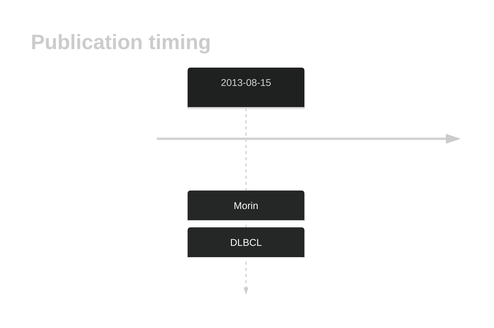

# CDH9
## History

## Relevance tier by entity

|Entity|Tier|Description                              |
|:------:|:----:|-----------------------------------------|
| |2   |relevance in DLBCL not firmly established|

## Mutation incidence in large patient cohorts (GAMBL reanalysis)

|Entity|source        |frequency (%)|
|:------:|:--------------:|:-------------:|
|DLBCL |GAMBL genomes |3.63         |
|DLBCL |Schmitz cohort|3.40         |
|DLBCL |Reddy cohort  |2.90         |
|DLBCL |Chapuy cohort |2.56         |

## Mutation pattern and selective pressure estimates

|Entity|aSHM|Significant selection|dN/dS (missense)|dN/dS (nonsense)|
|:------:|:----:|:---------------------:|:----------------:|:----------------:|
|BL    |No  |No                   |0.920           |0               |
|DLBCL |No  |No                   |2.641           |0               |
|FL    |No  |No                   |0.774           |0               |

> [!NOTE]
> First described in DLBCL in 2013 by [Morin RD](https://pubmed.ncbi.nlm.nih.gov/23699601)

View coding variants in ProteinPaint [hg19](https://morinlab.github.io/LLMPP/GAMBL/CDH9_protein.html)  or [hg38](https://morinlab.github.io/LLMPP/GAMBL/CDH9_protein_hg38.html)

View all variants in GenomePaint [hg19](https://morinlab.github.io/LLMPP/GAMBL/CDH9.html)  or [hg38](https://morinlab.github.io/LLMPP/GAMBL/CDH9_hg38.html)

## CDH9 Expression

<!-- ORIGIN: morinMutationalStructuralAnalysis2013 -->
<!-- DLBCL: morinMutationalStructuralAnalysis2013 -->
## References
1.  Morin RD, Mungall K, Pleasance E, Mungall AJ, Goya R, Huff RD, Scott DW, Ding J, Roth A, Chiu R, Corbett RD, Chan FC, Mendez-Lago M, Trinh DL, Bolger-Munro M, Taylor G, Hadj Khodabakhshi A, Ben-Neriah S, Pon J, Meissner B, Woolcock B, Farnoud N, Rogic S, Lim EL, Johnson NA, Shah S, Jones S, Steidl C, Holt R, Birol I, Moore R, Connors JM, Gascoyne RD, Marra MA. Mutational and structural analysis of diffuse large B-cell lymphoma using whole-genome sequencing. Blood. 2013 Aug 15;122(7):1256–1265. PMCID: PMC3744992
