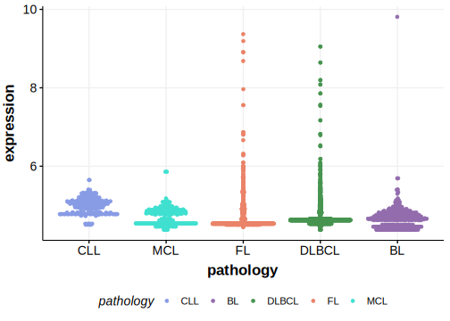

[[_TOC_]]

## Relevance tier by entity

[[include:tables/table1_CDH9.md]]

## Mutation incidence in large patient cohorts (GAMBL reanalysis)

|Entity|source        |frequency (%)|
|:------:|:--------------:|:-------------:|
|DLBCL |GAMBL genomes |3.63         |
|DLBCL |Schmitz cohort|3.40         |
|DLBCL |Reddy cohort  |2.90         |
|DLBCL |Chapuy cohort |2.56         |

## Mutation pattern and selective pressure estimates

[[include:tables/dnds_CDH9.md]]

[[include:tables/browser_CDH9.md]]

## Expression

<!-- ORIGIN: morinMutationalStructuralAnalysis2013 -->
<!-- DLBCL: morinMutationalStructuralAnalysis2013 -->

## All Mutations[@morinMutationalStructuralAnalysis2013]

[RG008](https://www.bcgsc.ca/downloads/morinlab/GAMBL/Morin_2013/RG008.html)
[RG034](https://www.bcgsc.ca/downloads/morinlab/GAMBL/Morin_2013/RG034.html)
[RG065](https://www.bcgsc.ca/downloads/morinlab/GAMBL/Morin_2013/RG065.html)

[[include:tables/mermaid_CDH9.md]]

## References
