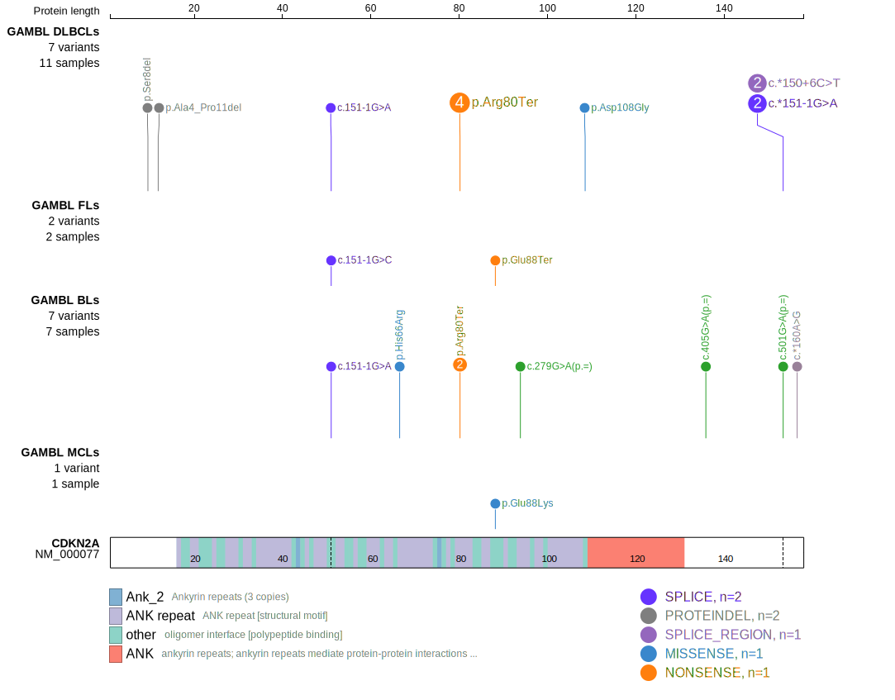
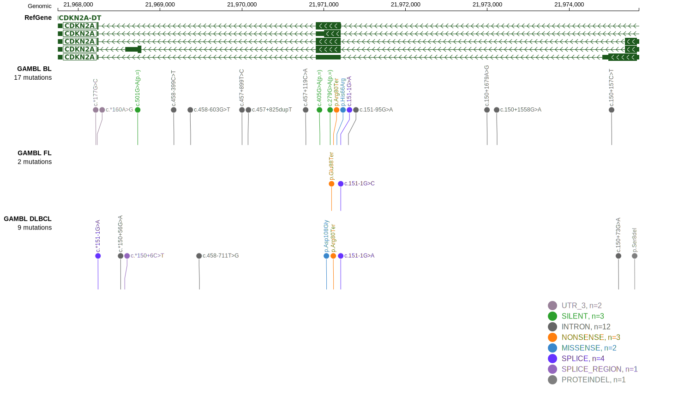
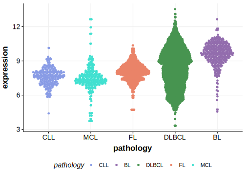

# CDKN2A
## Overview
Although CDKN2A aberrations are common in DLBCL, this gene is predominantly affected by copy number alterations. One study found that deletions of the CDKN2A locus occur in about one-third of DLBCL patients.1 The mutation pattern in DLBCL and FL implies the preferential accumulation of *inactivating mutations*. This gene has some recurrent sites of mutations (hotspots) with the most common mutation causing a truncation at codon 80 (R80*). 

## History
Mutations in this gene were first described in DLBCL and FL in 2013 by Morin et al2 and in BL in 2019 by Grande et al.3

## Relevance tier by entity

|Entity|Tier|Description                           |
|:------:|:----:|--------------------------------------|
||1|high-confidence PMBL/cHL/GZL gene|
||2|relevance in MZL not firmly established|
| |1   |high-confidence DLBCL gene            |
|    |2   |relevance in BL not firmly established|

## Mutation incidence in large patient cohorts (GAMBL reanalysis)

|Entity|source               |frequency (%)|
|:------:|:---------------------:|:-------------:|
|DLBCL |GAMBL genomes        |3.25         |
|DLBCL |Schmitz cohort       |4.89         |
|DLBCL |Reddy cohort         |1.00         |
|DLBCL |Chapuy cohort        |1.71         |
|BL    |GAMBL genomes+capture|1.85         |
|BL    |Thomas cohort        |3.00         |
|BL    |Panea cohort         |3.00         |

## Mutation pattern and selective pressure estimates

|Entity|Isoform        |aSHM|Significant selection|dN/dS (missense)|dN/dS (nonsense)|
|:------:|:---------------:|:----:|:---------------------:|:----------------:|:----------------:|
|BL    |CDKN2A.p14arf  |No  |No                   |10.947          | 72.708         |
|DLBCL |CDKN2A.p14arf  |No  |Yes                  |19.055          |102.121         |
|FL    |CDKN2A.p14arf  |No  |No                   | 0.000          |117.964         |
|BL    |CDKN2A.p16INK4a|No  |No                   | 2.931          |104.823         |
|DLBCL |CDKN2A.p16INK4a|No  |Yes                  | 5.631          |442.466         |
|FL    |CDKN2A.p16INK4a|No  |No                   | 0.000          |159.196         |

## CDKN2A Hotspots

| Chromosome |Coordinate (hg19) | ref>alt | HGVSp | 
 | :---:| :---: | :--: | :---: |
| chr9 | 21971120 | G>A | R80* |

View coding variants in ProteinPaint [hg19](https://morinlab.github.io/LLMPP/GAMBL/CDKN2A_protein.html)  or [hg38](https://morinlab.github.io/LLMPP/GAMBL/CDKN2A_protein_hg38.html)

View all variants in GenomePaint [hg19](https://morinlab.github.io/LLMPP/GAMBL/CDKN2A.html)  or [hg38](https://morinlab.github.io/LLMPP/GAMBL/CDKN2A_hg38.html)

## CDKN2A Expression

## References
1. *Guney S, Jardin F, Bertrand P, Mareschal S, Parmentier F, Picquenot JM, Tilly H, Bastard C. Several mechanisms lead to the inactivation of the CDKN2A (P16), P14ARF, or CDKN2B (P15) genes in the GCB and ABC molecular DLBCL subtypes. Genes Chromosomes Cancer. 2012 Sep;51(9):858-67. doi: 10.1002/gcc.21970. Epub 2012 May 23. PMID: 22619049.*

2.  *Morin RD, Mungall K, Pleasance E, Mungall AJ, Goya R, Huff RD, Scott DW, Ding J, Roth A, Chiu R, Corbett RD, Chan FC, Mendez-Lago M, Trinh DL, Bolger-Munro M, Taylor G, Hadj Khodabakhshi A, Ben-Neriah S, Pon J, Meissner B, Woolcock B, Farnoud N, Rogic S, Lim EL, Johnson NA, Shah S, Jones S, Steidl C, Holt R, Birol I, Moore R, Connors JM, Gascoyne RD, Marra MA. Mutational and structural analysis of diffuse large B-cell lymphoma using whole-genome sequencing. Blood. 2013 Aug 15;122(7):1256–1265. PMCID: PMC3744992*

3. *Grande BM, Gerhard DS, Jiang A, Griner NB, Abramson JS, Alexander TB, Allen H, Ayers LW, Bethony JM, Bhatia K, Bowen J, Casper C, Choi JK, Culibrk L, Davidsen TM, Dyer MA, Gastier-Foster JM, Gesuwan P, Greiner TC, Gross TG, Hanf B, Harris NL, He Y, Irvin JD, Jaffe ES, Jones SJM, Kerchan P, Knoetze N, Leal FE, Lichtenberg TM, Ma Y, Martin JP, Martin MR, Mbulaiteye SM, Mullighan CG, Mungall AJ, Namirembe C, Novik K, Noy A, Ogwang MD, Omoding A, Orem J, Reynolds SJ, Rushton CK, Sandlund JT, Schmitz R, Taylor C, Wilson WH, Wright GW, Zhao EY, Marra MA, Morin RD, Staudt LM. Genome-wide discovery of somatic coding and noncoding mutations in pediatric endemic and sporadic Burkitt lymphoma. Blood. 2019 Mar 21;133(12):1313–1324.* 

<!-- ORIGIN: 23699601 -->
<!-- BL: grandeGenomewideDiscoverySomatic2019 -->
<!-- DLBCL: morinMutationalStructuralAnalysis2013 -->
<!-- MZL: spinaGeneticsNodalMarginal2016b -->
