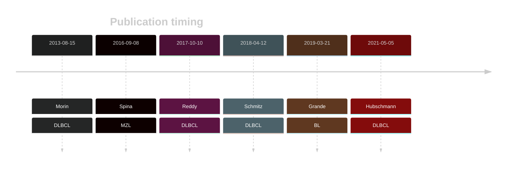

# CDKN2A

## Overview
Although CDKN2A aberrations are common in DLBCL, this gene is predominantly affected by copy number alterations. One study found that deletions of the CDKN2A locus occur in about one-third of DLBCL patients.1 The mutation pattern in DLBCL and FL implies the preferential accumulation of *inactivating mutations*. This gene has some recurrent sites of mutations (hotspots) with the most common mutation causing a truncation at codon 80 (R80*). 

## Relevance tier by entity

|Entity|Tier|Description                           |
|:------:|:----:|--------------------------------------|
||1|high-confidence PMBL/cHL/GZL gene|
||2|relevance in MZL not firmly established[@spinaGeneticsNodalMarginal2016]|
| |1   |high-confidence DLBCL gene            [@morinMutationalStructuralAnalysis2013]|
|    |2   |relevance in BL not firmly established[@grandeGenomewideDiscoverySomatic2019]|

## Mutation incidence in large patient cohorts (GAMBL reanalysis)

|Entity|source               |frequency (%)|
|:------:|:---------------------:|:-------------:|
|DLBCL |GAMBL genomes        |3.25         |
|DLBCL |Schmitz cohort       |4.89         |
|DLBCL |Reddy cohort         |1.00         |
|DLBCL |Chapuy cohort        |1.71         |
|BL    |GAMBL genomes+capture|1.85         |
|BL    |Thomas cohort        |3.00         |
|BL    |Panea cohort         |3.00         |

## Mutation pattern and selective pressure estimates

|Entity|Isoform        |aSHM|Significant selection|dN/dS (missense)|dN/dS (nonsense)|
|:------:|:---------------:|:----:|:---------------------:|:----------------:|:----------------:|
|BL    |CDKN2A.p14arf  |No  |No                   |10.947          | 72.708         |
|DLBCL |CDKN2A.p14arf  |No  |Yes                  |19.055          |102.121         |
|FL    |CDKN2A.p14arf  |No  |No                   | 0.000          |117.964         |
|BL    |CDKN2A.p16INK4a|No  |No                   | 2.931          |104.823         |
|DLBCL |CDKN2A.p16INK4a|No  |Yes                  | 5.631          |442.466         |
|FL    |CDKN2A.p16INK4a|No  |No                   | 0.000          |159.196         |

## CDKN2A Hotspots

| Chromosome |Coordinate (hg19) | ref>alt | HGVSp | 
 | :---:| :---: | :--: | :---: |
| chr9 | 21971120 | G>A | R80* |

View coding variants in ProteinPaint [hg19](https://morinlab.github.io/LLMPP/GAMBL/CDKN2A_protein.html)  or [hg38](https://morinlab.github.io/LLMPP/GAMBL/CDKN2A_protein_hg38.html)

View all variants in GenomePaint [hg19](https://morinlab.github.io/LLMPP/GAMBL/CDKN2A.html)  or [hg38](https://morinlab.github.io/LLMPP/GAMBL/CDKN2A_hg38.html)

## CDKN2A Expression

## References

<!-- ORIGIN: 23699601 -->
<!-- BL: grandeGenomewideDiscoverySomatic2019 -->
<!-- DLBCL: morinMutationalStructuralAnalysis2013 -->
<!-- MZL: spinaGeneticsNodalMarginal2016b -->
