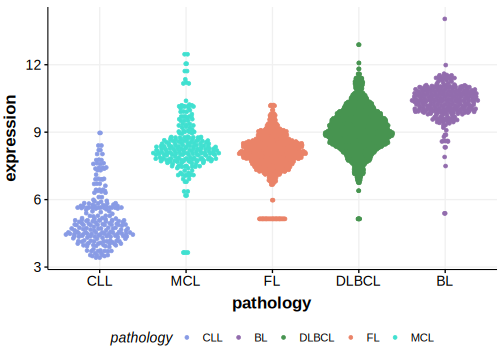

[[_TOC_]]

## Relevance tier by entity

[[include:tables/table1_CDKN2C.md]]

## Mutation incidence in large patient cohorts (GAMBL reanalysis)

|Entity|source               |frequency (%)|
|:------:|:---------------------:|:-------------:|
|BL    |GAMBL genomes+capture|2.54         |
|BL    |Thomas cohort        |3.40         |
|BL    |Panea cohort         |3.00         |

## Mutation pattern and selective pressure estimates

[[include:tables/dnds_CDKN2C.md]]

[[include:tables/browser_CDKN2C.md]]

## Expression

<!-- ORIGIN: thomasGeneticSubgroupsInform2023 -->
<!-- BL: thomasGeneticSubgroupsInform2023 -->

[[include:tables/mermaid_CDKN2C.md]]

## References
