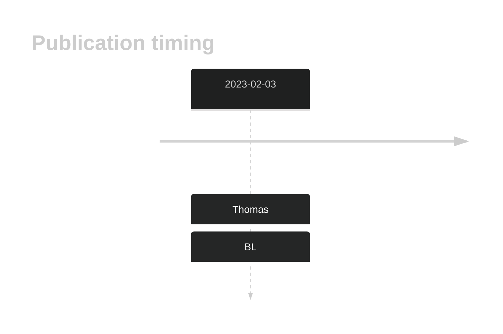

# CDKN2C

## History

## Relevance tier by entity

|Entity|Tier|Description                           |
|:------:|:----:|--------------------------------------|
|    |2   |relevance in BL not firmly established[@thomasGeneticSubgroupsInform2023]|

## Mutation incidence in large patient cohorts (GAMBL reanalysis)

|Entity|source               |frequency (%)|
|:------:|:---------------------:|:-------------:|
|BL    |GAMBL genomes+capture|2.54         |
|BL    |Thomas cohort        |3.40         |
|BL    |Panea cohort         |3.00         |

## Mutation pattern and selective pressure estimates

|Entity|aSHM|Significant selection|dN/dS (missense)|dN/dS (nonsense)|
|:------:|:----:|:---------------------:|:----------------:|:----------------:|
|BL    |No  |No                   |16.525          |50.872          |
|DLBCL |No  |No                   | 3.474          | 0.000          |
|FL    |No  |No                   | 0.000          | 0.000          |

View coding variants in ProteinPaint [hg19](https://morinlab.github.io/LLMPP/GAMBL/CDKN2C_protein.html)  or [hg38](https://morinlab.github.io/LLMPP/GAMBL/CDKN2C_protein_hg38.html)

View all variants in GenomePaint [hg19](https://morinlab.github.io/LLMPP/GAMBL/CDKN2C.html)  or [hg38](https://morinlab.github.io/LLMPP/GAMBL/CDKN2C_hg38.html)

## CDKN2C Expression

<!-- ORIGIN: thomasGeneticSubgroupsInform2023 -->
<!-- BL: thomasGeneticSubgroupsInform2023 -->

## References
