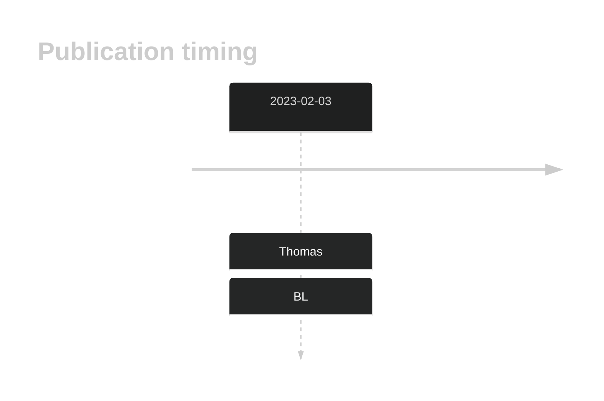

# CDKN2C

## History

## Relevance tier by entity

|Entity|Tier|Description                           |
|:------:|:----:|--------------------------------------|
|    |2   |relevance in BL not firmly established|

## Mutation incidence in large patient cohorts (GAMBL reanalysis)

|Entity|source               |frequency (%)|
|:------:|:---------------------:|:-------------:|
|BL    |GAMBL genomes+capture|2.54         |
|BL    |Thomas cohort        |3.40         |
|BL    |Panea cohort         |3.00         |

## Mutation pattern and selective pressure estimates

|Entity|aSHM|Significant selection|dN/dS (missense)|dN/dS (nonsense)|
|:------:|:----:|:---------------------:|:----------------:|:----------------:|
|BL    |No  |No                   |16.525          |50.872          |
|DLBCL |No  |No                   | 3.474          | 0.000          |
|FL    |No  |No                   | 0.000          | 0.000          |

View coding variants in ProteinPaint [hg19](https://morinlab.github.io/LLMPP/GAMBL/CDKN2C_protein.html)  or [hg38](https://morinlab.github.io/LLMPP/GAMBL/CDKN2C_protein_hg38.html)

View all variants in GenomePaint [hg19](https://morinlab.github.io/LLMPP/GAMBL/CDKN2C.html)  or [hg38](https://morinlab.github.io/LLMPP/GAMBL/CDKN2C_hg38.html)

## CDKN2C Expression

<!-- ORIGIN: thomasGeneticSubgroupsInform2023 -->
<!-- BL: thomasGeneticSubgroupsInform2023 -->

## References
1.  Thomas N, Dreval K, Gerhard DS, Hilton LK, Abramson JS, Ambinder RF, Barta S, Bartlett NL, Bethony J, Bhatia K, Bowen J, Bryan AC, Cesarman E, Casper C, Chadburn A, Cruz M, Dittmer DP, Dyer MA, Farinha P, Gastier-Foster JM, Gerrie AS, Grande BM, Greiner T, Griner NB, Gross TG, Harris NL, Irvin JD, Jaffe ES, Henry D, Huppi R, Leal FE, Lee MS, Martin JP, Martin MR, Mbulaiteye SM, Mitsuyasu R, Morris V, Mullighan CG, Mungall AJ, Mungall K, Mutyaba I, Nokta M, Namirembe C, Noy A, Ogwang MD, Omoding A, Orem J, Ott G, Petrello H, Pittaluga S, Phelan JD, Ramos JC, Ratner L, Reynolds SJ, Rubinstein PG, Sissolak G, Slack G, Soudi S, Swerdlow SH, Traverse-Glehen A, Wilson WH, Wong J, Yarchoan R, ZenKlusen JC, Marra MA, Staudt LM, Scott DW, Morin RD. Genetic subgroups inform on pathobiology in adult and pediatric Burkitt lymphoma. Blood. 2023 Feb 23;141(8):904–916. 
