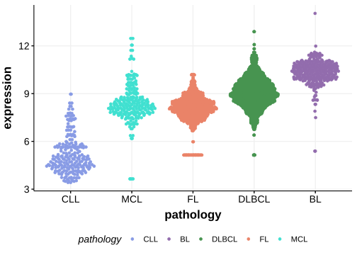

[[_TOC_]]

## Relevance tier by entity

[[include:tables/table1_CDKN2C.md]]

## Mutation incidence in large patient cohorts (GAMBL reanalysis)

### BL
[[include:tables/BL_CDKN2A.md]]

### DLBCL
[[include:tables/DLBCL_CDKN2A.md]]

### FL
[[include:tables/FL_CDKN2A.md]]

## Mutation pattern and selective pressure estimates

[[include:tables/dnds_CDKN2C.md]]

[[include:tables/browser_CDKN2C.md]]

## Expression

<!-- ORIGIN: thomasGeneticSubgroupsInform2023 -->
<!-- BL: thomasGeneticSubgroupsInform2023 -->

[[include:tables/mermaid_CDKN2C.md]]

## References
