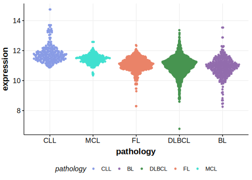

[[_TOC_]]

## Overview

Mutations in this gene were first described in DLBCL in 2017 by Reddy et al.[@reddyGeneticFunctionalDrivers2017] Subsequent exome and genome-wide studies of DLBCL did not reproduce this observation. 

## Relevance tier by entity

[[include:tables/table1_CHD1.md]]

## Warnings

<<Warn("The variants reported in this gene in DLBCL failed QC")>>

## Mutation incidence in large patient cohorts (GAMBL reanalysis)

|Entity|source        |frequency (%)|
|:------:|:--------------:|:-------------:|
|DLBCL |GAMBL genomes |2.10         |
|DLBCL |Schmitz cohort|2.98         |
|DLBCL |Reddy cohort  |2.90         |
|DLBCL |Chapuy cohort |2.14         |

## Mutation pattern and selective pressure estimates

[[include:tables/dnds_CHD1.md]]

[[include:tables/browser_CHD1.md]]

## Expression

[[include:tables/mermaid_CHD1.md]]

## References

<!-- ORIGIN: reddyGeneticFunctionalDrivers2017 -->
<!-- DLBCL: reddyGeneticFunctionalDrivers2017 -->
