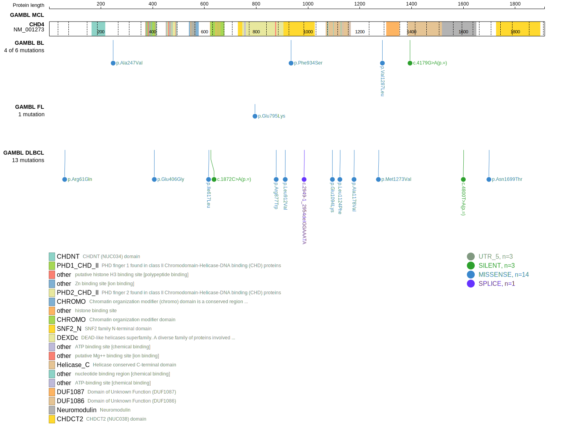

# CHD4

## Relevance tier by entity

|Entity|Tier|Description                           |
|:------:|:----:|--------------------------------------|
|BL    |2   |relevance in BL not firmly established|

## Mutation incidence in large patient cohorts (GAMBL reanalysis)

|Entity|source               |frequency (%)|
|:------:|:---------------------:|:-------------:|
|BL    |GAMBL genomes+capture|3.93         |
|BL    |Thomas cohort        |  NA         |
|BL    |Panea cohort         |  NA         |

## Mutation pattern and selective pressure estimates

|Entity|aSHM|Significant selection|dN/dS (missense)|dN/dS (nonsense)|
|:------:|:----:|:---------------------:|:----------------:|:----------------:|
|BL    |No  |No                   |1.781           |0               |
|DLBCL |No  |No                   |3.513           |0               |
|FL    |No  |No                   |1.815           |0               |

> [!NOTE]
> First described in BL in 2022 by [Burkhardt B](https://pubmed.ncbi.nlm.nih.gov/35794096)

View coding variants in ProteinPaint [hg19](https://morinlab.github.io/LLMPP/GAMBL/CHD4_protein.html)  or [hg38](https://morinlab.github.io/LLMPP/GAMBL/CHD4_protein_hg38.html)

View all variants in GenomePaint [hg19](https://morinlab.github.io/LLMPP/GAMBL/CHD4.html)  or [hg38](https://morinlab.github.io/LLMPP/GAMBL/CHD4_hg38.html)

## CHD4 Expression

<!-- ORIGIN: schmitzBurkittLymphomaPathogenesis2012 -->
