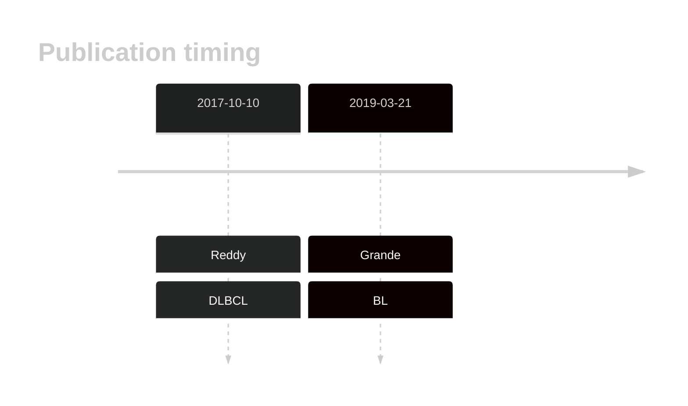

# CHD8

<<Warn("The variants reported in this gene in DLBCL failed QC")>>

## Relevance tier by entity

|Entity|Tier|Description                              |
|:------:|:----:|-----------------------------------------|
||1|high-confidence PMBL/cHL/GZL gene|
| |2   |relevance in DLBCL not firmly established[@reddyGeneticFunctionalDrivers2017]|
|    |1   |high-confidence BL gene                  [@grandeGenomewideDiscoverySomatic2019]|

## Mutation incidence in large patient cohorts (GAMBL reanalysis)

|Entity|source               |frequency (%)|
|:------:|:---------------------:|:-------------:|
|BL    |GAMBL genomes+capture| 8.78        |
|BL    |Thomas cohort        | 8.50        |
|BL    |Panea cohort         |16.80        |
|DLBCL |GAMBL genomes        | 1.91        |
|DLBCL |Schmitz cohort       | 3.62        |
|DLBCL |Reddy cohort         | 2.90        |
|DLBCL |Chapuy cohort        | 2.99        |

## Mutation pattern and selective pressure estimates

|Entity|aSHM|Significant selection|dN/dS (missense)|dN/dS (nonsense)|
|:------:|:----:|:---------------------:|:----------------:|:----------------:|
|BL    |No  |Yes                  |3.551           |14.940          |
|DLBCL |No  |No                   |1.619           | 0.000          |
|FL    |No  |No                   |1.344           |12.679          |

View coding variants in ProteinPaint [hg19](https://morinlab.github.io/LLMPP/GAMBL/CHD8_protein.html)  or [hg38](https://morinlab.github.io/LLMPP/GAMBL/CHD8_protein_hg38.html)

View all variants in GenomePaint [hg19](https://morinlab.github.io/LLMPP/GAMBL/CHD8.html)  or [hg38](https://morinlab.github.io/LLMPP/GAMBL/CHD8_hg38.html)

## CHD8 Expression

## References

<!-- ORIGIN: reddyGeneticFunctionalDrivers2017 -->
<!-- BL: grandeGenomewideDiscoverySomatic2019 -->
<!-- DLBCL: reddyGeneticFunctionalDrivers2017 -->
