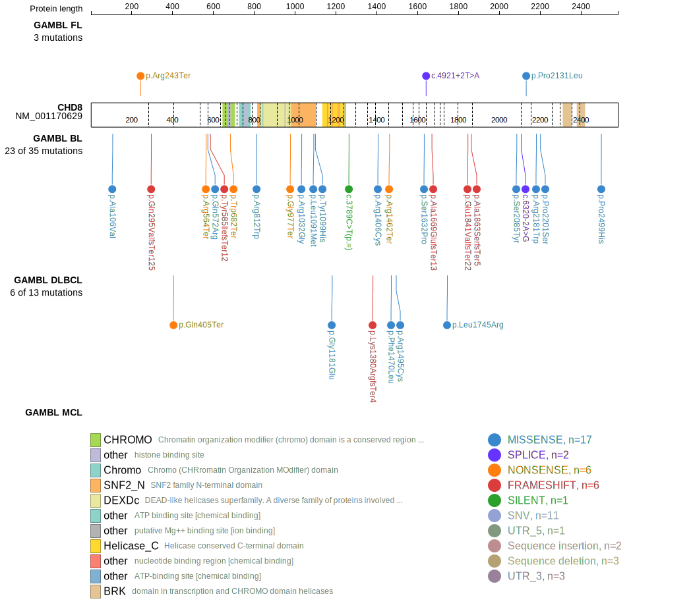
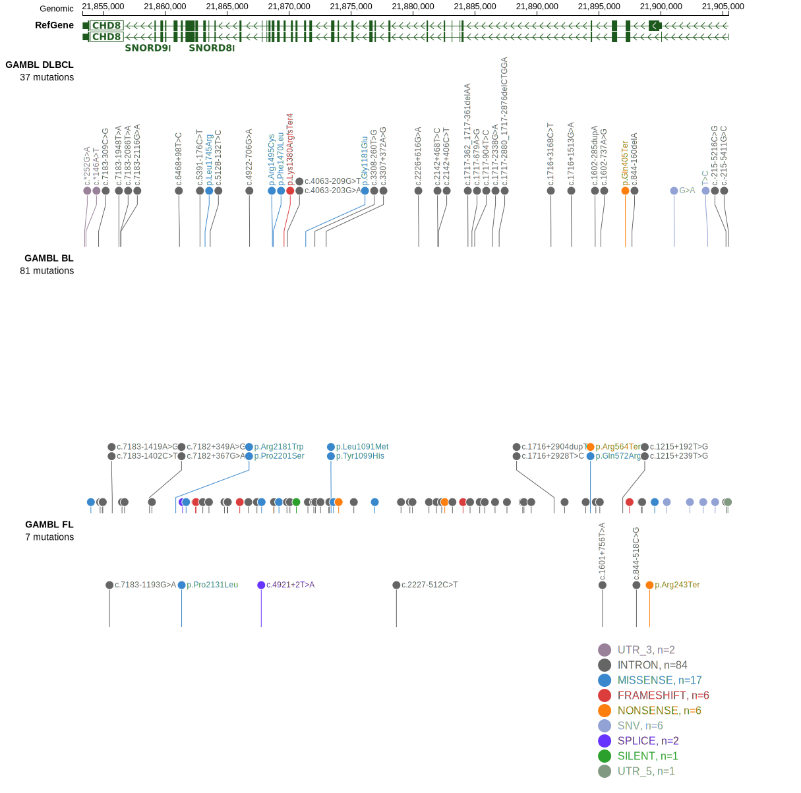

# CHD8
## History
Mutations in this gene were first described in DLBCL in 2017 by Reddy et al1 and in BL in 2019 by Grande et al.2

## Relevance tier by entity

|Entity|Tier|Description                              |
|:------:|:----:|-----------------------------------------|
|    |1   |high-confidence BL gene                  |
| |2   |relevance in DLBCL not firmly established|

## Mutation incidence in large patient cohorts (GAMBL reanalysis)

|Entity|source               |frequency (%)|
|:------:|:---------------------:|:-------------:|
|BL    |GAMBL genomes+capture| 8.78        |
|BL    |Thomas cohort        | 8.50        |
|BL    |Panea cohort         |16.80        |
|DLBCL |GAMBL genomes        | 1.91        |
|DLBCL |Schmitz cohort       | 3.62        |
|DLBCL |Reddy cohort         | 2.90        |
|DLBCL |Chapuy cohort        | 2.99        |

## Mutation pattern and selective pressure estimates

|Entity|aSHM|Significant selection|dN/dS (missense)|dN/dS (nonsense)|
|:------:|:----:|:---------------------:|:----------------:|:----------------:|
|BL    |No  |Yes                  |3.551           |14.940          |
|DLBCL |No  |No                   |1.619           | 0.000          |
|FL    |No  |No                   |1.344           |12.679          |

View coding variants in ProteinPaint [hg19](https://morinlab.github.io/LLMPP/GAMBL/CHD8_protein.html)  or [hg38](https://morinlab.github.io/LLMPP/GAMBL/CHD8_protein_hg38.html)

View all variants in GenomePaint [hg19](https://morinlab.github.io/LLMPP/GAMBL/CHD8.html)  or [hg38](https://morinlab.github.io/LLMPP/GAMBL/CHD8_hg38.html)

## CHD8 Expression

## References

1.  *Reddy A, Zhang J, Davis NS, Moffitt AB, Love CL, Waldrop A, Leppa S, Pasanen A, Meriranta L, Karjalainen-Lindsberg ML, Nørgaard P, Pedersen M, Gang AO, Høgdall E, Heavican TB, Lone W, Iqbal J, Qin Q, Li G, Kim SY, Healy J, Richards KL, Fedoriw Y, Bernal-Mizrachi L, Koff JL, Staton AD, Flowers CR, Paltiel O, Goldschmidt N, Calaminici M, Clear A, Gribben J, Nguyen E, Czader MB, Ondrejka SL, Collie A, Hsi ED, Tse E, Au-Yeung RKH, Kwong YL, Srivastava G, Choi WWL, Evens AM, Pilichowska M, Sengar M, Reddy N, Li S, Chadburn A, Gordon LI, Jaffe ES, Levy S, Rempel R, Tzeng T, Happ LE, Dave T, Rajagopalan D, Datta J, Dunson DB, Dave SS. Genetic and Functional Drivers of Diffuse Large B Cell Lymphoma. Cell. 2017 Oct;171(2):481-494.e15.*
2.  *Grande BM, Gerhard DS, Jiang A, Griner NB, Abramson JS, Alexander TB, Allen H, Ayers LW, Bethony JM, Bhatia K, Bowen J, Casper C, Choi JK, Culibrk L, Davidsen TM, Dyer MA, Gastier-Foster JM, Gesuwan P, Greiner TC, Gross TG, Hanf B, Harris NL, He Y, Irvin JD, Jaffe ES, Jones SJM, Kerchan P, Knoetze N, Leal FE, Lichtenberg TM, Ma Y, Martin JP, Martin MR, Mbulaiteye SM, Mullighan CG, Mungall AJ, Namirembe C, Novik K, Noy A, Ogwang MD, Omoding A, Orem J, Reynolds SJ, Rushton CK, Sandlund JT, Schmitz R, Taylor C, Wilson WH, Wright GW, Zhao EY, Marra MA, Morin RD, Staudt LM. Genome-wide discovery of somatic coding and noncoding mutations in pediatric endemic and sporadic Burkitt lymphoma. Blood. 2019 Mar 21;133(12):1313–1324.*

<!-- ORIGIN: reddyGeneticFunctionalDrivers2017 -->
<!-- BL: grandeGenomewideDiscoverySomatic2019 -->
<!-- DLBCL: reddyGeneticFunctionalDrivers2017 -->
