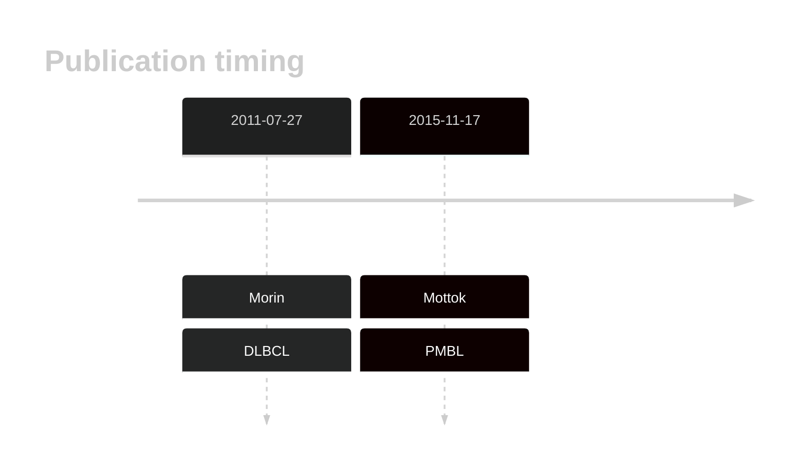
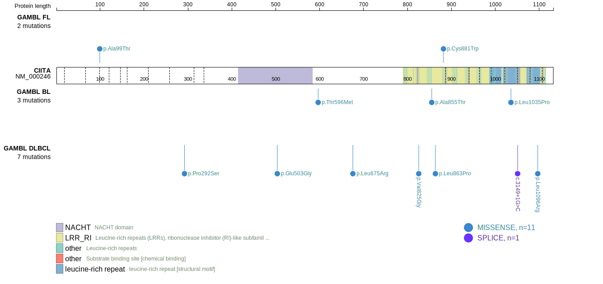
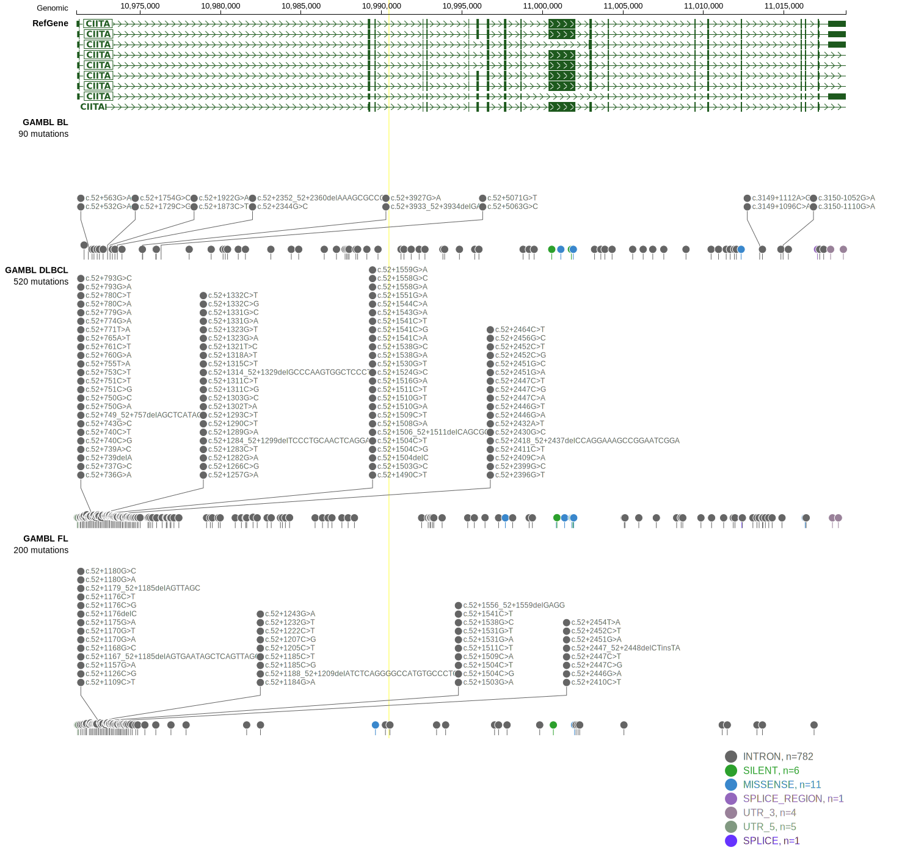
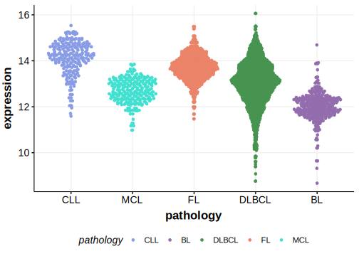

# CIITA

## Overview
CIITA encodes the major histocompatibility complex (MHC) class II transactivator.  CIITA mutations are frequent in PMBCL. These mutations often include structural genomic rearrangements, missense, nonsense, and frameshift mutations. In PMBCL, these mutations are thought to contribute to loss of MHC expression.1  Although loss of CIITA and MHC Class II Expression is commonly observed in DLBCL, the role of mutations and methylation affecting this locus remains unclear.2 CIITA is one of [a number of genes](https://github.com/morinlab/LLMPP/wiki/ashm) affected by aberrant somatic hypermutation in B-cell lymphomas, which complicates the interpretation of mutations at this locus.

## Relevance tier by entity

|Entity|Tier|Description               |
|:------:|:----:|--------------------------|
||1|high-confidence PMBL/cHL/GZL gene[@mottokGenomicAlterationsCIITA2015]|
| |1-a | aSHM target and high-confidence DLBCL gene[@morinFrequentMutationHistonemodifying2011]|

## Mutation incidence in large patient cohorts (GAMBL reanalysis)

[[include:DLBCL_CIITA.md]]
[[include:FL_CIITA.md]]

## Mutation pattern and selective pressure estimates

[[include:dnds_CIITA.md]]

## aSHM regions

|chr_name|hg19_start|hg19_end|region                                                                                    |regulatory_comment             |
|:--------:|:----------:|:--------:|:------------------------------------------------------------------------------------------:|:-------------------------------:|
|chr16   |10970795  |10975465|[TSS](https://genome.ucsc.edu/s/rdmorin/GAMBL%20hg19?position=chr16%3A10970795%2D10975465)|active_promoter-strong_enhancer|

View coding variants in ProteinPaint [hg19](https://morinlab.github.io/LLMPP/GAMBL/CIITA_protein.html)  or [hg38](https://morinlab.github.io/LLMPP/GAMBL/CIITA_protein_hg38.html)

View all variants in GenomePaint [hg19](https://morinlab.github.io/LLMPP/GAMBL/CIITA.html)  or [hg38](https://morinlab.github.io/LLMPP/GAMBL/CIITA_hg38.html)

## CIITA Expression

## References

<!-- ORIGIN: morinFrequentMutationHistonemodifying2011 -->
<!-- DLBCL: morinFrequentMutationHistonemodifying2011 -->
<!-- PMBL: mottokGenomicAlterationsCIITA2015b -->
