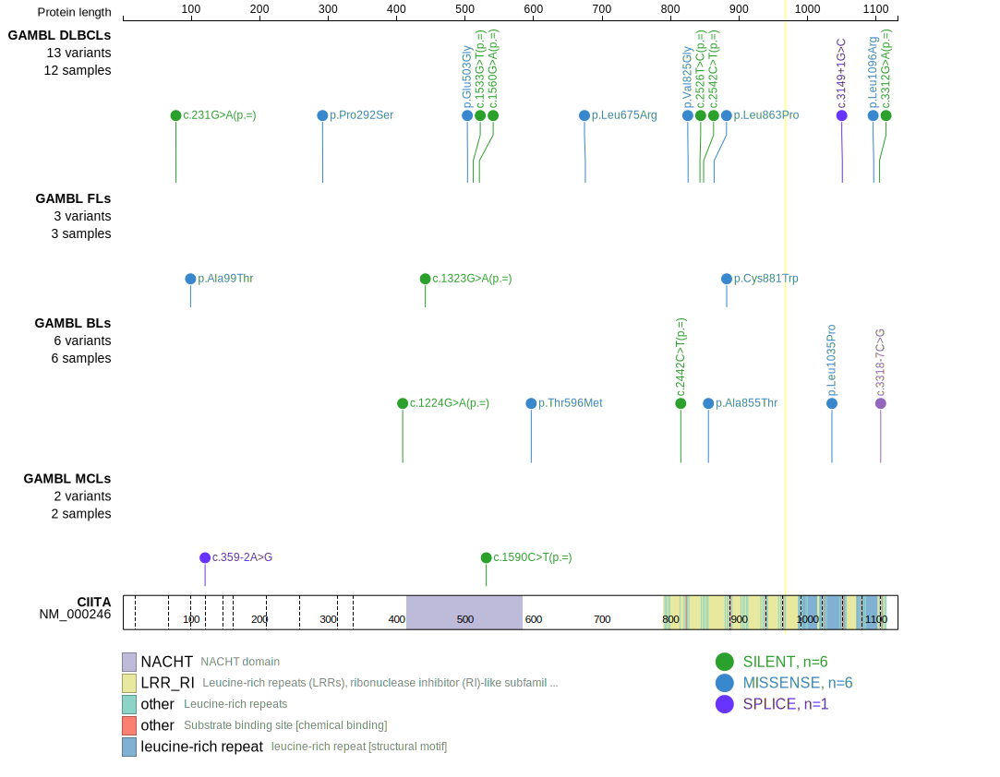

CIITA is one of [a number of genes](https://github.com/morinlab/LLMPP/wiki/ashm) affected by aberrant somatic hypermutation in B-cell lymphomas, which complicates the interpretation of mutations at this locus.

## Mutation tier

|Entity|Tier|Description               |
|:------:|:----:|--------------------------|
|DLBCL |1-a   |high-confidence DLBCL gene, hypermutated|

## Mutation incidence

|Entity|source        |frequency (%)|
|:------:|:--------------:|:-------------:|
|DLBCL |GAMBL genomes |2.87         |
|DLBCL |Schmitz cohort|6.60         |
|DLBCL |Reddy cohort  |4.30         |
|DLBCL |Chapuy cohort |4.30         |

## Mutation pattern

|Entity|aSHM|Significant selection|dN/dS (missense)|dN/dS (nonsense)|
|:------:|:----:|:---------------------:|:----------------:|:----------------:|
|BL    |Yes |No                   |1.029           |0.000           |
|DLBCL |Yes |No                   |0.648           |4.031           |
|FL    |Yes |No                   |2.701           |0.000           |

## aSHM regions

|chr_name|hg19_start|hg19_end|region                                                                                    |regulatory_comment             |
|:--------:|:----------:|:--------:|:------------------------------------------------------------------------------------------:|:-------------------------------:|
|chr16   |10970795  |10975465|[TSS](https://genome.ucsc.edu/s/rdmorin/GAMBL%20hg19?position=chr16%3A10970795%2D10975465)|active_promoter-strong_enhancer|

> [!NOTE]
> First described in DLBCL in 2011 by [Morin RD](https://pubmed.ncbi.nlm.nih.gov/21796119)

View coding variants in ProteinPaint [hg19](https://www.bcgsc.ca/downloads/morinlab/GAMBL/test/genes/CIITA_protein.html)  or [hg38](https://www.bcgsc.ca/downloads/morinlab/GAMBL/test/genes/CIITA_protein_hg38.html)

View all variants in GenomePaint [hg19](https://www.bcgsc.ca/downloads/morinlab/GAMBL/test/genes/CIITA.html)  or [hg38](https://www.bcgsc.ca/downloads/morinlab/GAMBL/test/genes/CIITA_hg38.html)

