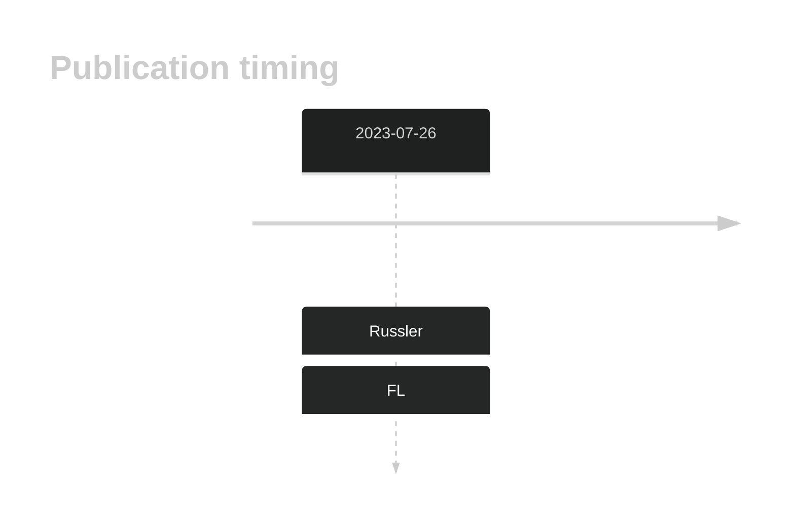

# CILP

## History

## Relevance tier by entity

|Entity|Tier|Description                           |
|:------:|:----:|--------------------------------------|
|    |2   |relevance in FL not firmly established[@russler-germainMutationsAssociatedProgression2023b]|

## Mutation incidence in large patient cohorts (GAMBL reanalysis)

|Entity|source       |frequency (%)|
|:------:|:-------------:|:-------------:|
|FL    |GAMBL genomes|0.46         |

## Mutation pattern and selective pressure estimates

|Entity|aSHM|Significant selection|dN/dS (missense)|dN/dS (nonsense)|
|:------:|:----:|:---------------------:|:----------------:|:----------------:|
|BL    |No  |No                   |0.915           |0               |
|DLBCL |No  |No                   |0.460           |0               |
|FL    |No  |No                   |0.000           |0               |

View coding variants in ProteinPaint [hg19](https://morinlab.github.io/LLMPP/GAMBL/CILP_protein.html)  or [hg38](https://morinlab.github.io/LLMPP/GAMBL/CILP_protein_hg38.html)

View all variants in GenomePaint [hg19](https://morinlab.github.io/LLMPP/GAMBL/CILP.html)  or [hg38](https://morinlab.github.io/LLMPP/GAMBL/CILP_hg38.html)

## CILP Expression

<!-- ORIGIN: russler-germainMutationsAssociatedProgression2023a -->
<!-- FL: russler-germainMutationsAssociatedProgression2023b -->

## References
