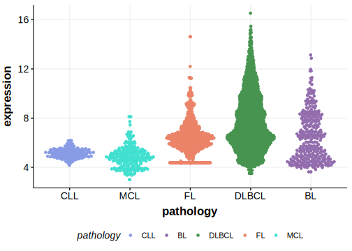

[[_TOC_]]

## Relevance tier by entity

|Entity|Tier|Description                           |
|:------:|:----:|--------------------------------------|
|    |2   |relevance in FL not firmly established[@russler-germainMutationsAssociatedProgression2023]|

## Mutation incidence in large patient cohorts (GAMBL reanalysis)

|Entity|source       |frequency (%)|
|:------:|:-------------:|:-------------:|
|FL    |GAMBL genomes|0.46         |

## Mutation pattern and selective pressure estimates

[[include:dnds_CILP.md]]

[[include:browser_CILP.md]]

## Expression

<!-- ORIGIN: russler-germainMutationsAssociatedProgression2023a -->
<!-- FL: russler-germainMutationsAssociatedProgression2023b -->

[[include:mermaid_CILP.md]]

## References
