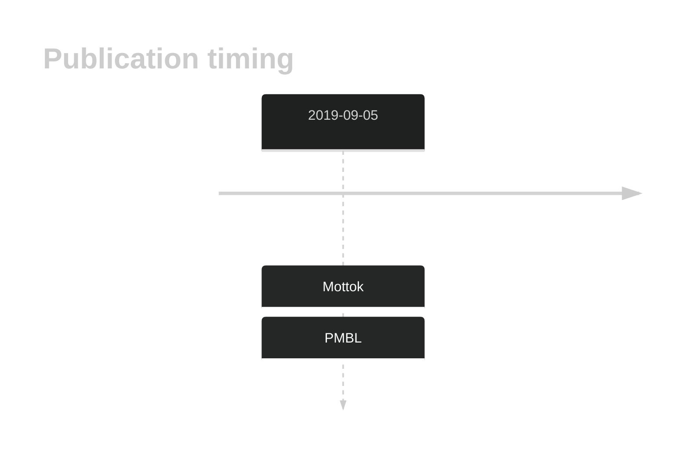

# CISH

## History

## Relevance tier by entity

|Entity|Tier|Description|
|:------:|:----:|--------------------------------------|
||1|high-confidence PMBL/cHL/GZL gene[@mottokIntegrativeGenomicAnalysis2019]|

## Mutation incidence in large patient cohorts (GAMBL reanalysis)

|Entity|source |frequency (%)|
|:------:|:----:|:----:|
|BL|GAMBL Exome |0.575 |
|DLBCL|GAMBL Exome |0.377 |
|DLBCL|GAMBL Genome |0.188 |
|FL|GAMBL Exome |0.573 |

## References

